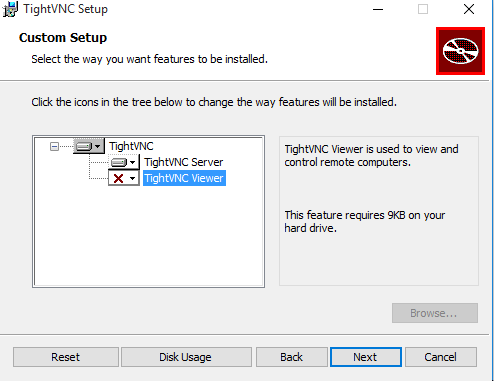
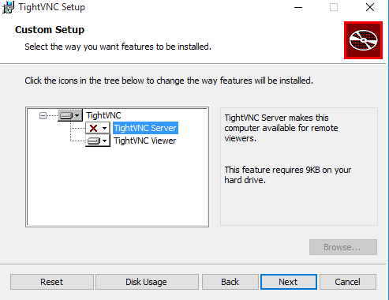
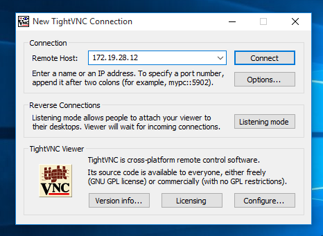
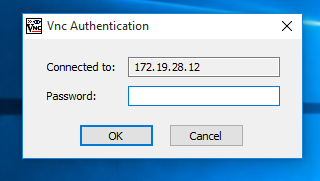
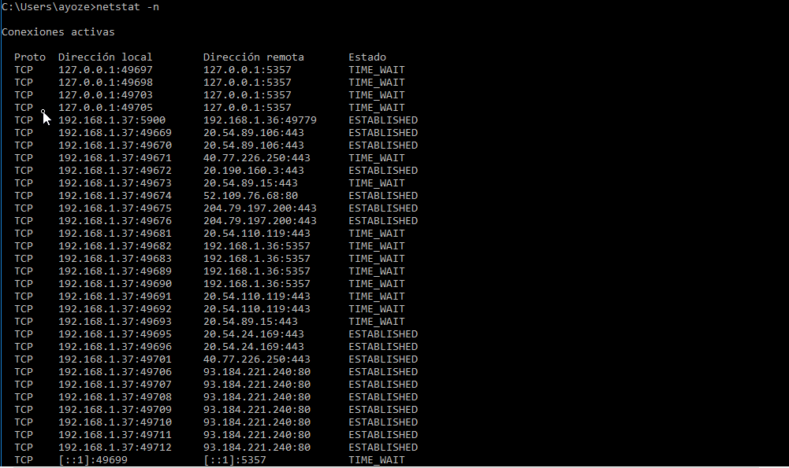

# Conexiones VNC.

## Configuraciones previas de las máquinas.
```
| Sistema Operativo | Rol | Ip de la máquina |
|-------------------|-----|------------------|
| Windows 10        |master|172.XX.AA.12|
| Windows 10        |slave|172.XX.AA.11|
| Opensuse          |master|172.XX.AA.12|
| Opensuse          |slave|172.XX.AA.12|
```

## Conexiones VNC: Windows 10.

Instalamos Tight VNC server y Tight VNC viewer en 2 máquinas con Windows 10 respectivamente.


### Tight VNC server.



A la hora de la instalación configuramos las contraseñas de acceso al servicio.


## NMAP.

Ejecutamos el comando nmap desde la máquina real y comprobamos que los puertos 5800 y 5900 estan abiertos para conexiones VNC.


### Tight VNC client.



Nos aseguramos de que el cortafuegos de Windows nos permite las conexiones VNC.


### Conexión desde el Windows Slave master al Windows Slave y netstat.

Abrimos la aplicacion **VNC viewer** desde el **Windows Slave master** para conectarnos a nuestro servidor, es decir el **Windows Slave**, para ello nos pedirá una ip a la que conectarnos y una contraseña (que configuramos previamente).





Como comprobación final usaremos el comando netstat -n para visualizar las conexiones entre la máquina slave y la máquina master.



# Conexiones VNC: Opensuse

Configuramos desde el Yast el cortafuegos para que sean posibles las conexiones de tipo VNC e instalaremos 
