# Conexiones VNC.

## Configuraciones previas de las máquinas.

| Sistema Operativo | Rol | Ip de la máquina |
|-------------------|-----|------------------|
| Windows 10        |master|172.XX.AA.12|
| Windows 10        |slave|172.XX.AA.11|
| Opensuse          |master|172.XX.AA.12|
| Opensuse          |slave|172.XX.AA.12|


## Conexiones VNC: Windows 10.

Instalamos Tight VNC server y Tight VNC viewer en 2 máquinas con Windows 10 respectivamente.


### Tight VNC server.

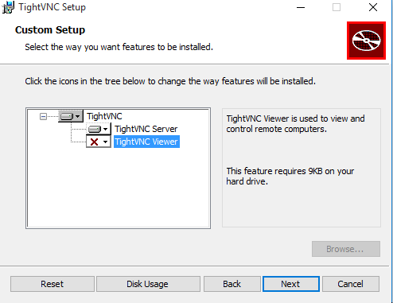

A la hora de la instalación configuramos las contraseñas de acceso al servicio.

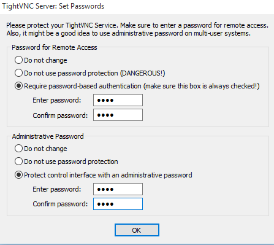

## NMAP.

Ejecutamos el comando nmap desde la máquina real y comprobamos que los puertos 5800 y 5900 estan abiertos para conexiones VNC.

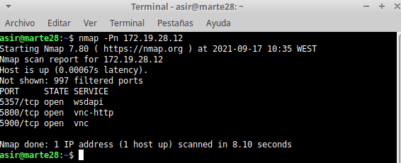

### Tight VNC client.


Nos aseguramos de que el cortafuegos de Windows nos permite las conexiones VNC.

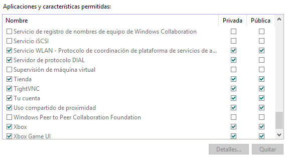

### Conexión desde el Windows Slave master al Windows Slave y netstat.

Abrimos la aplicacion **VNC viewer** desde el **Windows Slave master** para conectarnos a nuestro servidor, es decir el **Windows Slave**, para ello nos pedirá una ip a la que conectarnos y una contraseña (que configuramos previamente).


Vemos que nos podemos conectar a nuestro equipo en remoto.

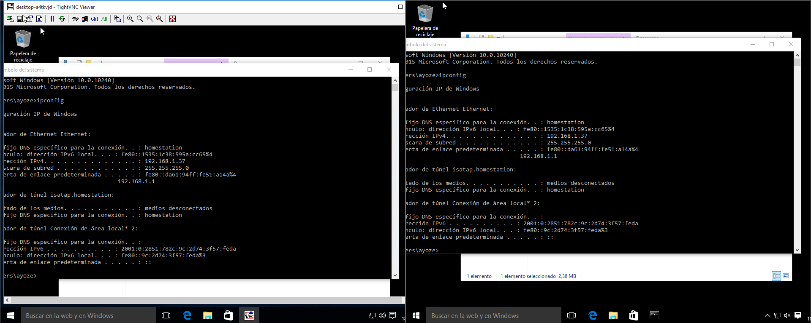

Como comprobación final usaremos el comando netstat -n para visualizar las conexiones entre la máquina slave y la máquina master.

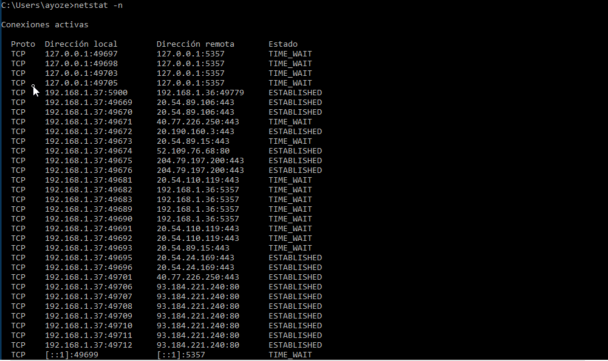

# Conexiones VNC: Opensuse.

### Opensuse Slave.

Configuramos desde el Yast el cortafuegos para que sean posibles las conexiones de tipo VNC e instalaremos un serverVNC en una las maquinas Opensuse, esta será nuestra máquina esclavo o slave.

Para ello debemos:

* Permitir las conexiones VNC en el cortafuegos.

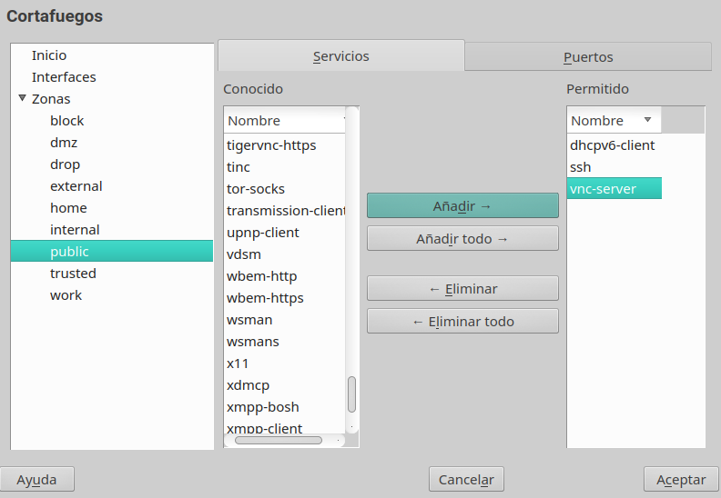

* Incluir desde el Yast el servicio de VNC server, este lo podemos iniciar por comando o por interfaz gráfica.

* En el Yast configuramos la administración remota del vnc server he instalamos los paquetes necsarios.

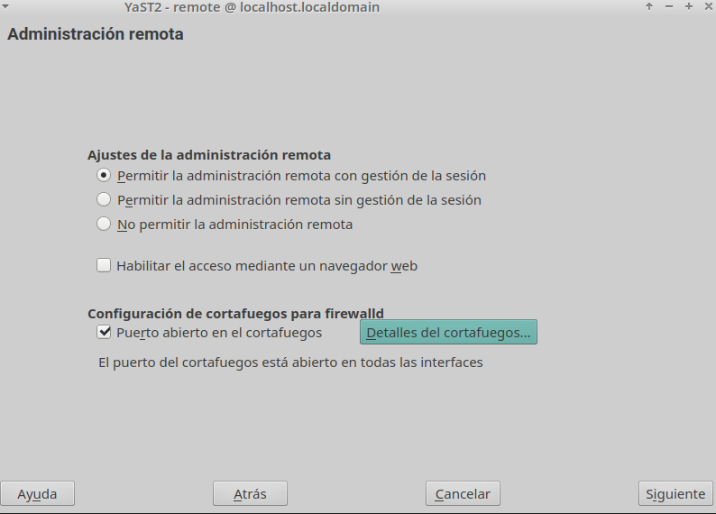

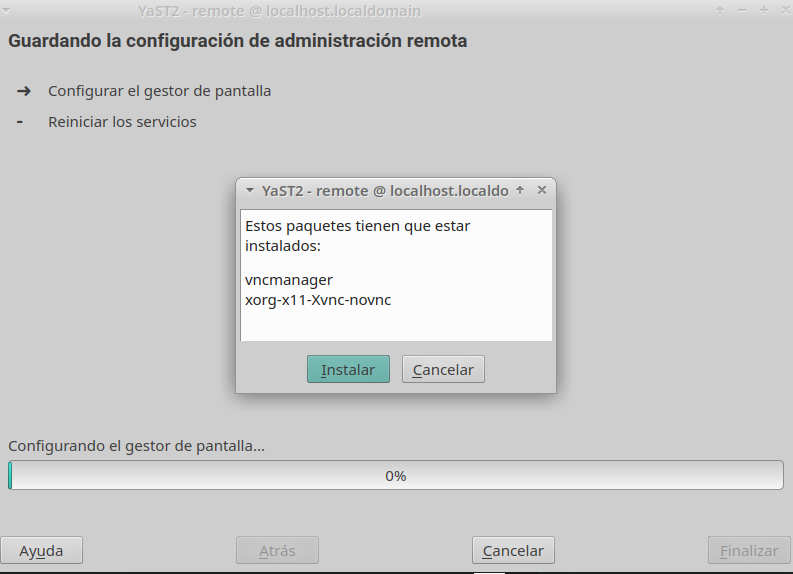

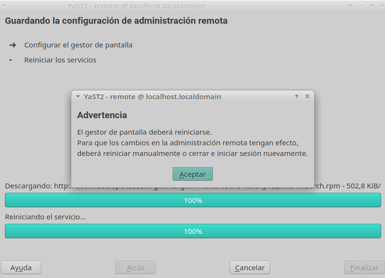

* Establecer claves para conexiones VNC. Se nos mostrará un numero para nuestro escritorio remoto, lo anotamos (número **N**) en nuestro caso es 2..

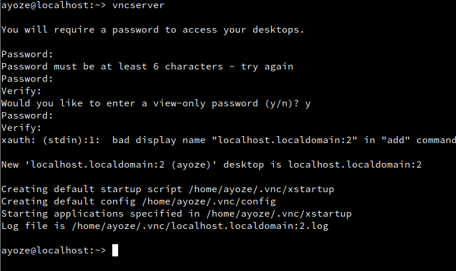

* Ejecutamos el comando ```ps -ef | grep vnc``` para comprobar los servicios relacionados con VNC que están activos.

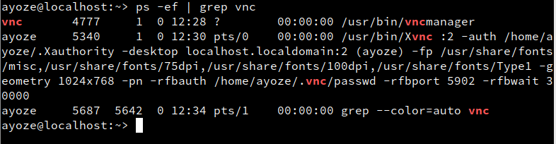

* Ejecutamos `lsof -i -n` para comprobar que los puertos abiertos para VNC son 580X y 590X.

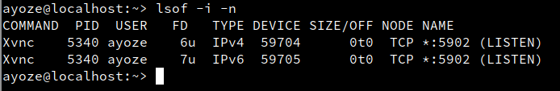

### Comprobaciones.

Ejecutamos **`nmap -Pn 172.19.28.32`** para ver que los puertos disponibles desde fuera son los puertos 5801 y 5901

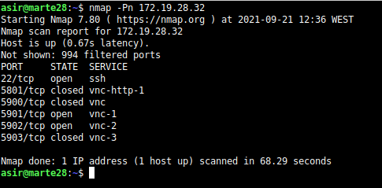

### Opensuse Master VNC.

Para conectarnos a nuestro servidor VNC en opensuse abriremos un terminal y escribimos ```vncviewer```.

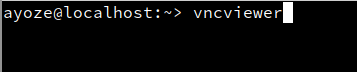

* Se nos abrirá una ventana en la que escribiremos ``ip-vnc-server: N`` y nos conectamos.

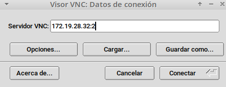

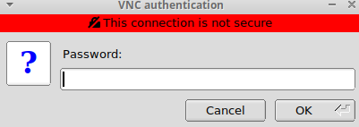

* Ejecutar ```lsof -i -n``` en el server

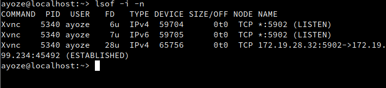

* Ejecutar ```vncserver -list``` en el server

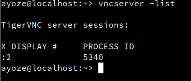

### Comprobaciones con SSOO cruzados.

* Conexión desde cliente Windows al servidor VNC Linux.

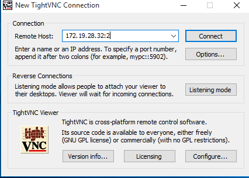
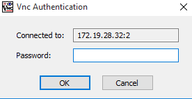

* Ejecutar netstat -n en el servidor Windows.

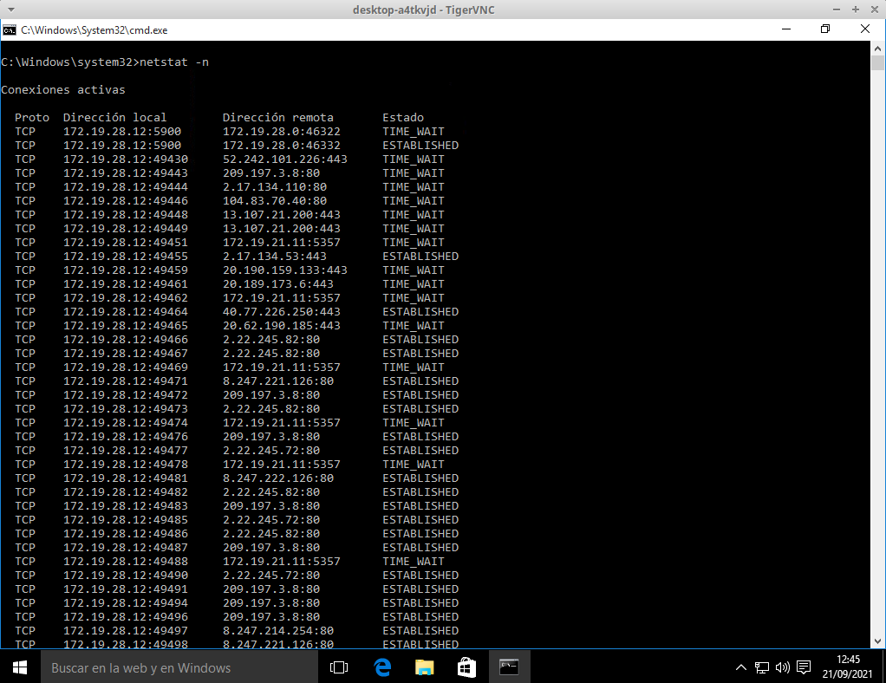

* Conectar desde cliente Linux a servidor VNC Windows.

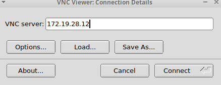


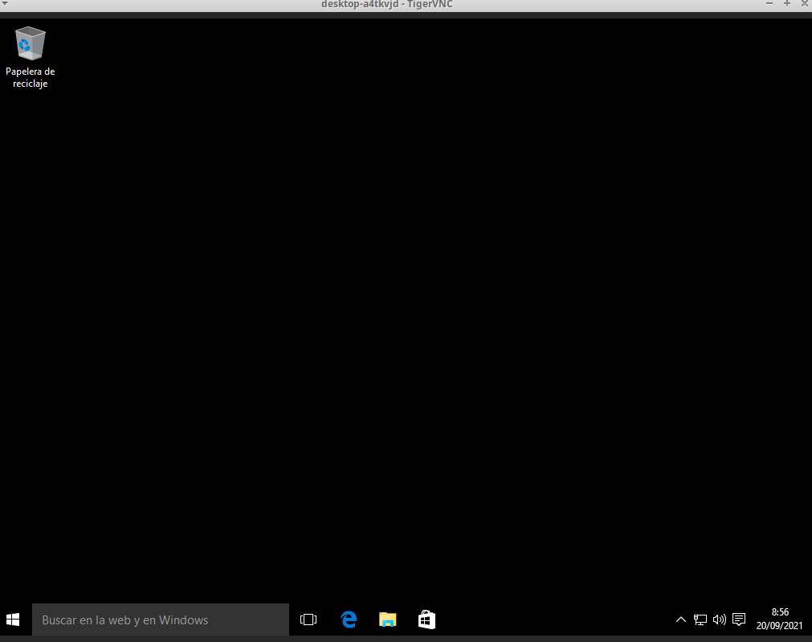

* Ejecutar lsof -i.

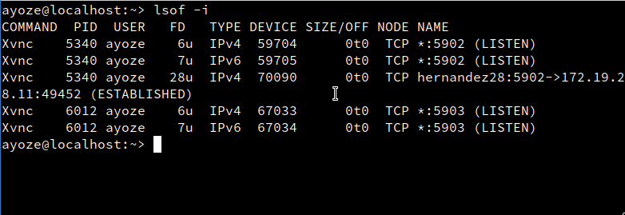

## Display 0 en GNU/Linux.

Para controlar la pantalla local de manera directa usaremos x0vncserver, para ello debemos hacer lo siguiente.

* Ir al server.

* Ejecutar el siguiente comando: x0vncserver -display :0 -passwordfile /home/ayoze/.vnc/passwd.


* lsof -i -n.

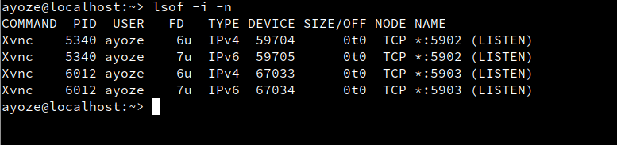

* Ir al cliente y conectarnos al server.
