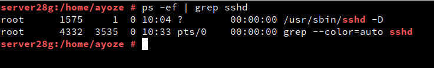
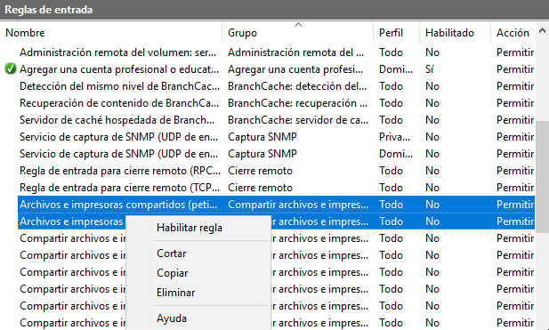
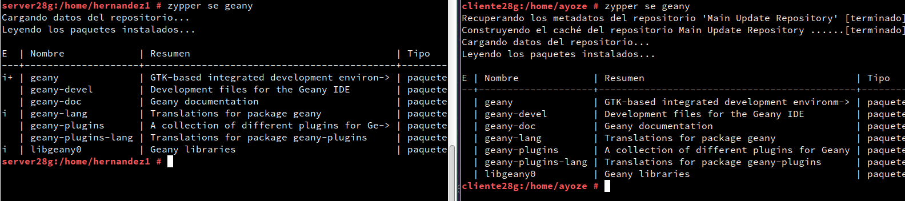

# Concección SSH

Para relizar esta practica vamos a necesitar las siguientes 4 máquinas virtuales:

| Sistema Operativo | Rol | Ip de la máquina | Hostname |
|-------------------|-----|------------------|----------|
| Windows 10        |cliente|172.XX.AA.22|cliente28w|
| Windows 10 server |server|172.XX.AA.21|server28w|
| Opensuse          |cliente|172.XX.AA.32| cliente28g|
| Opensuse          |server|172.XX.AA.31| server28g|

## Opensuse

Cambiamos la contraseña root por una contraseña segura.


En el archivo /etc/hosts añadimos las ips de las máquinas cliente de windows y de opensuse.


Crearemos 4 usuarios en server28g:

+ hernandez1
+ hernandez2
+ hernandez3
+ hernandez4

Esto se hace de la siguiente manera:


## Cliente Opensuse

Tenemos que abrir el fichero /etc/hosts y añadir las ips del cliente windows y del servidor opensuse como en el primer paso.


## Cliente Windows
En el cliente windows lo que debemos hacer es editar el fichero hosts ubicado en la ruta ```C:\Windows\System32\drivers\etc\hosts``` y añadir las ips del cliente y server opensuse.


## Instalacion del servicio ssh

Ahora debemos de instalar el paquete openssh en nuestro server para hacer posibles las conexiones ssh.


Comprobamos que el servicio se encuentra activo sin errores de funcionamiento, podemos hacerlo de las 2 maneras mostradas abajo.




Comprobamos que podemos hacer ping a la máquina opensuse.


Comprobamos que el cortafuegos permite las conexiones ssh


Comprobamos que el puerto para el ssh es el 22.


Otra manera seía usar el comando
~~~

lsof -i:22 -Pn

~~~


## Windows

Debemos de abrir el cortafuegos para permitir el envio de paquetes y habilitar la entrada y salida de pings.



Ahora debemos de instalar el programa o aplicacion **Putty**.

A continuación veremos los pasos para la instalación del **Putty**; en la mayoría de los pasos debemos de apretar siguiente.


Aqui podemos escoger la ruta de instalación.


Aquí podemos añadir un icono a nuestra barra de tarea.


Abrimos el **Putty** y añadimos la ip en el cuadro debajo de la frase ``Host Name (or IP address)``


Ahora nos aparece una advertencia de seguridad del programa de Putty, se resume en que el equipo no conoce la clave ssh de seguridad y que si queremos seguir adelante, elegimos **Accept**.


Ahora se nos abre un cuadro para introducir un usuario y contraseña del server de Linux.


### Claves SSH dentro del server

Las claves SSH se encuentran alojadas todas en el directorio /etc/ssh, comprobamos esto con los comandos **vdir** o **ls**, en mi caso uso **ls | grep ssh_host** para filtrar solo las claves ssh del host.


Ahora modificamos el fichero ssh_host_rsa_key y comentamos todas las lineas y dejamos la linea
**Hostkey /etc/ssh/ssh_host_rsa_key**, esto lo que hace es permitir solo el uso de claves de tipo RSA.


## Regeneración de claves SSH

Ahora vamos a comprobar que si el cliente detecta algo extraño con nuestra clave no la va a reconocer; para ello generamos una clave nueva con el comando **ssh-keygen -t rsa -f /etc/ssh/ssh_host_rsa_key**


Reiniciamos el servicio SSH e intentamos conectarnos desde las máquinas de windows y Opensuse.


Vemos que nos da un error debido a que la clave SSH es incorrecta en el caso de Opensuse


Para arreglarla debemos de ejecutar el comando que nos proporciona la propia advertencia.


Intentamos conectarnos de nuevo y vemos que no hay errores ahora


Ahora vamos a windows y hacemos el proceso de conexion al servidor ssh de nuevo y nos sale la una advertencia, pero podemos simplemente ignorarla, aceptar y conectarnos de nuevo al server.


## Personalizacion del Bash

Abrimos el fichero **/home/apellido1/.barshc** y añadimos las líneas siguientes:


Además de esto vamos a crear un fichero que defina unos *alias* para algunos comandos, este fichero lo creamos en **/home/apellido1/.alias**.


Ahora probamos a conectarnos al servidor Linux con la máquina Opensuse y probamos que ha cambiado el Bash de apariencia y que podemos usar esos comandos personalizados.


Hacemos lo mismo en Windows.


## Identificación mediante claves públicas

Debemos de dirigirnos al cliente y generar una clave ssh nueva que copiaremos al servidor para que nos autentifique de manera automática.

Generación de clave:


Copiado de clave al server:


Comprobamos que nos deja conectarnos sin contraseña.


Lo mismo para Windows, exepto que aquí si nos pide contraseña porque no tenemos nuestra clave copiada en el servidor.


## Uso de aplicaciones gráficas de manera remota.

Instalamos una aplicación (geany) en el servidor que no esté en el cliente.


Ahora comprobamos que el fichero **/etc/ssh/sshd_config** tiene actica la linea ```X11Forwarding yes```, esto lo que hace es permitir la ejecucion de manera gráfica de aplicaciones en el cliente sin que estén instaladas en el mismo


Comprobamos que realmente geany no está instalada.



Nos conectamos como normalmente, pero añadimos el parámetro ```-X``` (ssh -X user@ip/hostname)


Vemos que realmente se ha ejecutado.


## Aplicaciones nativas de Windows

Wine es un emulador de aplicaciones de windows disponible para Linux, con ella lo que vamos a hacer es ejecutar el notepad de wine de manera remota


## Denegación de usuarios

En el fichero **/etc/ssh/sshd_config** añadimos la linea DenyUsers hernandez2 en el server para que desde las máquinas remotas no se pueda acceder a ese usuario


Ahora comprobamos que la sintaxis es correcta, los valores son los siguientes:

* 0= CORRECTO
* 1= INCORRECTO


## Restricción uso de aplicaciones
