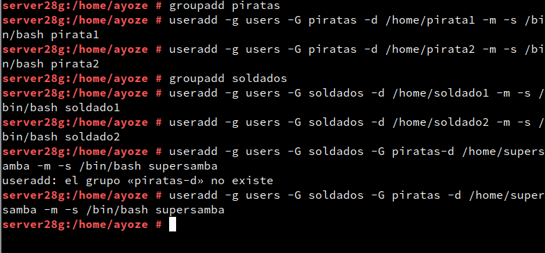

# Samba con OpenSUSE y Windows

## Servidor Samba

#### Preparativos

#### Usuarios locales

#### Creación de carpetas

#### Configuracion del Servidor Samba

#### Creación de los recursos compartidos

#### Usuarios Samba

#### Reiniciar

## Cliente Windows

### Acceso a los recursos compartidos

### Comandos en el cliente Windows

## Cliente OpenSUSE

### Acceso a los recursos compartidos

### Comandos en el cliente OpenSUSE

### Montaje automático

# Preguntas a resolver
