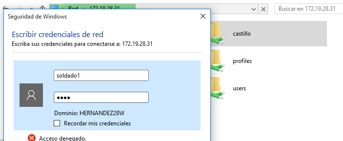
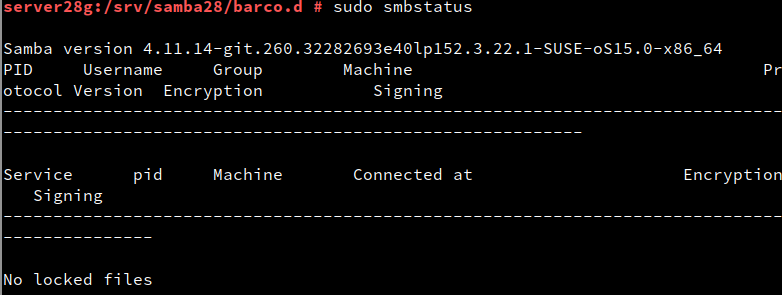
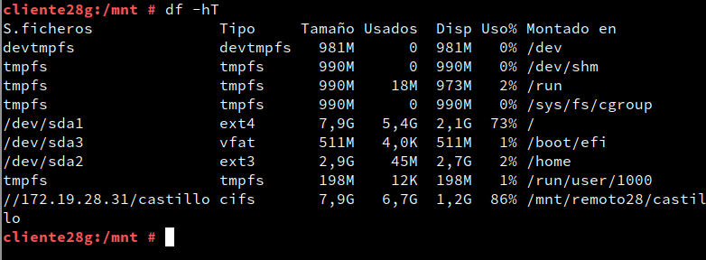

# Samba con OpenSUSE y Windows

## Servidor Samba

#### Preparativos

#### Usuarios locales

Debemos de crear los siguientes usuarios y grupos para realizar la practica.

~~~~
 Grupos

* Soldados
* Piratas
* sambausers

Usuarios
* soldado1
* soldado2
* pirata1
* pirata2
* sambaguest
* supersamba
~~~~

Aqui vemos como crearlos por comandos.

Ahora vamos a ver como crearlos por entorno gráfico.

En estas imágenes vemos la creación de un grupo.

Vemos todos los usuarios pertenecientes al grupo sambausers.

En estas vemos la creación de un usuario.

### Crear carpetas de los recursos compartidos

Creamos la siguiente estructura de carpetas con los permisos, grupos y usuarios propietarios especificados.

### Configurar servidor Samba

Instalamos el servidor Samba.

Copiamos el archivo de configuración de samba por seguridad.

En yast configuramos Samba.

Añadimos un grupo de trabajo

Esta parte la podemos dejar sin tocar ya que no es necesario ningun cambio.

Añadimos Samba en el cortafuegos para permitir las conexiones

Ejecutamos nmap -Pn para comprobar que realmente estan abiertos los puertos de samba (139 y 445).

### Crear recursos compartidos de red

En el fichero de configuracion de samba debemos de añadir las siguientes líneas.

Comprobamos que todo está bien

### Usuarios samba

Para añadir usuarios a samba debemos de ejecutar el comando **smbpasswd -a USUARIO** para establecer una contraseña para este y añadirlo.

Comprobamos la lista de usuarios de samba.

### Reiniciar Samba

Reiniciamos ambos servicios de samba

## Windows

Añadimos la maquina servidor samba en el fichero hosts de la maquina Windows.

### Acceso a los recursos compartidos con el cliente Windows

Nos conectamos desde el propio explorador de archivos de Windows al servidor samba poniendo en la barra de busqueda **\\\IP-SERVER-SAMBA**

Probamos a conectarnos al recurso compartido de castillo como soldado1.

Vemos en un cmd las conexiones activas con **net use**.

Vemos que no hay nada creado todavía en castillo.

Ahora borramos las conexiones con **net use * /d /y**.

Ahora probamos a conectarnos a barco con el mismo procedimiento.

Vemos los recursos compartidos disponibles.

### Comandos en el cliente Windows

Para montar un recurso de manera permanente debemos de escribir el siguiente comando:

Ahora comprobamos que tenemos una conexión activa a ese recurso.

### Cliente OpenSUSE

Añadimos a las maquinas servidor Samba y la máquina windows en el fichero **/etc/hosts** de la maquina cliente de OpenSUSE.

### Acceso a los recursos compartidos con el cliente OpenSUSE

Nos conectamos mediante el explorador de archivos.

Si intentamos acceder como soldado1 a barco nos devuelve la ventana de login porque no estamos autorizados en ese repositorio como ese usuario.

Accedemos finalmente al repositorio castillo.

Vemos el estado del servicio.

Vemos un listado de los repositorios disponibles.

~~~
DISCLAIMER: Aunque en la descripcion de los recursos castillo y barco ponga public de ayoze28
deberia poner sus descripciones respectivas una vez configurado de manera correcta el fichero /
etc/samba/smb.conf.

~~~

### Montaje automático

Creamos las carpetas remoto28/castillo dentro de **/mnt** para montar un recurso de manera permanente.

Montamos el recurso de manera permanente con el siguiente comando.

Vemos las conexiones activas en el momento tanto con df -hT para comprobar que está montado el recurso como con lsof -i -Pn para comprobar que está conectado al servidor y su recurso.

###### Contenido del fichero /etc/fstab

~~~

GNU nano 4.9.2 /etc/fstab
UUID=9f72d837-b192-469f-b2c1-c517823c86e9   / ext4 defaults o 1
UUID=94ffcdf2-1039-4058-a6bf-e4f5es15f6cO   swap swap defaults oe
UUID=dc1040fd-e718-44f9-a9df-767bf3735591   /home ext3 data=ordered 0 2
UUID=687E-A058                              /boot/efi vfat defaults e 2

//172.19.28.31/public /mnt/remoto28/public  cifs username=soldado1,password=1234 0 0

~~~

### Preguntas para resolver

* ¿Por qué tenemos dos servicios (smb y nmb) para Samba?

El servicio smb hace posible la compartición de archivos e impresión en pantalla de estos mismos para los clientes Windows, mientras que el servicio nmb responde a las peticiones de los equipos.

* ¿Las claves de los usuarios en GNU/Linux deben ser las mismas que las que usa Samba?

No necesariamente, podemos establecer la clave de usuario **1234** a pirata1 y que la clave de acceso a samba sea **pouOdc+fi¬juosda**

* ¿Puedo definir un usuario en Samba llamado soldado3, y que no exista como usuario del sistema?

No, no es posible, ya que samba solo usa los usuarios creados en el sistema y los agrega como usuariosd de sus servicios.

* ¿Cómo podemos hacer que los usuarios soldado1 y soldado2 no puedan acceder al sistema pero sí al samba?

Para que los usuarios soldado1 y soldado2 no puedan acceder al sistema podemos crear estos usuarios sin un home definido o borrar el que ya tienen una vez creados.
