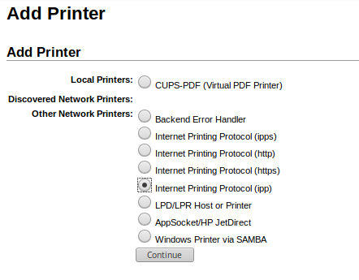
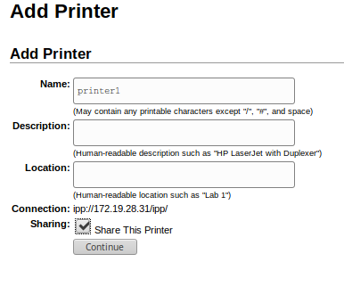
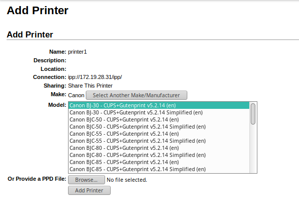
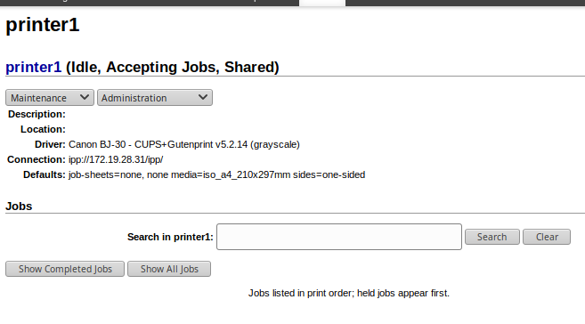
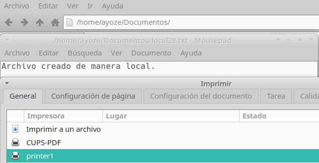

# Servidor de Impresión en Windows.

### Creación de la impresora

Para añadir una impresora virtual en opensuse nos dirigimos al naegador y en la barra de busqueda ponemos **localhost:631** para acceder a la ventana de configuración de CUPS.

Nos dirigimos a la pestaña de Administración.

Añadimos una impresora.

Nos pide usuario y contraseña, usamos root.

Ahora debemos de crear una impresora que sea accesible por protocolo ipp.

Establecemos un enlace para la conexión

Establecemos un nombre.

Establecemos el tipo de impresora.

Ahora el modelo.

Establecemos las opciones por defecto.

Vemos un resumen de la creación de la impresora.

### Impresión de archivos de manera local

Ahora intentamos imprimir un archivo por comandos, usamos el comando **lpr** para "imprimir" un documento, en este caso el fichero **hosts** en **/etc**.

Usamos **lpq** para ver la cola de impresión.

Si queremos borrar un elemento de la cola de impresión usamos el comando **lprm**

### Configuración del acceso a la impresora

Modificamos el fichero **/etc/cups/cupsd-conf** para que escuche e cualquier puerto **631** y permitimos los accesos al servidor.

Aquí habilitamos el acceso a los ficheros log.

Ahora recargamos el servicio CUPS.

### Acceso a la impresora

Tanto en el servidor como en el cliente debemos de permitir las conexiones de tipo ipp, para ver en que apartado del cortafuegos se encuentran las reglas relacionadas con ese protocolo usamos el siguiente comando.

Las habilitamos.

Instalamos el paquete **cups-pdf**.

Creamos un archivo que será impreso.

Vemos que nos aparecen 2 impresoras, una pertenece al paquete que acabamos de instalar, la otra es la que creamos con anterioridad.

Vemos que el fichero equivalente en pdf se ha creado, la ubicación de todos los pdf impresos es **/var/spools/cups-pdf/ayoze**

### Configuración de conexiones remotas

Ahora para las conexiones remotas debemos de agregar la ip de la maquina cliente en el servidor dentro del fichero de configuración del servidor.

### Impresión de archivos de manera remota

En el cliente debemos de ir a "Configuración de Impresión"

Desbloqueamos.

Ponemos la clave de root

Añadimos la impresora

Buscamos la ip de nuestra impresora y nos salen 2 busquedas relacionadas, estas son, la impresora de CUPS-PDF y printer1

Seguimos adelante y establecemos un nombre para esta.

Vemos ahora que el cliente tiene acceso a la impresora

Probamos a imprimir un archivo desde el cliente

Vemos que se ha creado en el servidor.

