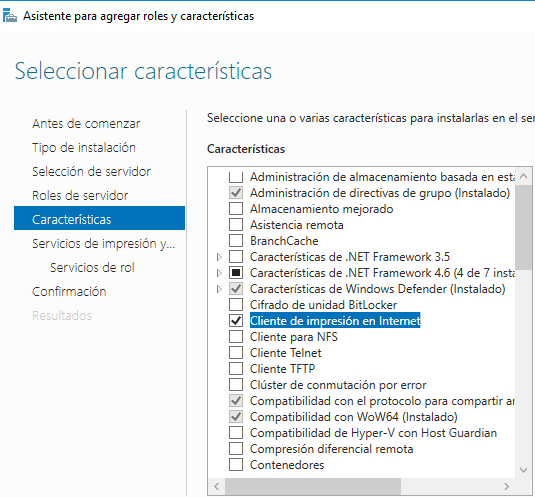
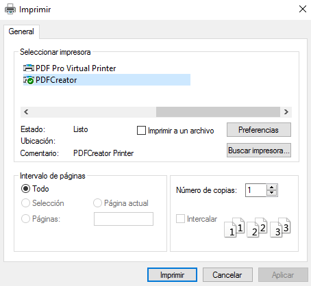
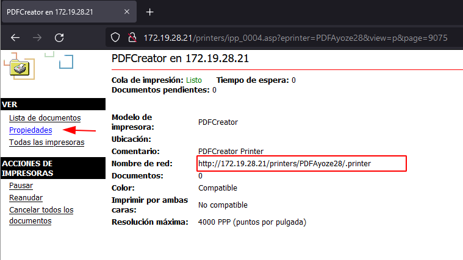
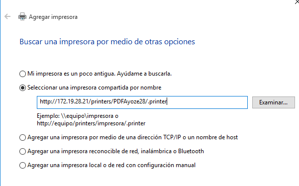
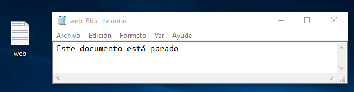

# Servidor de Impresión en Windows.

### Configuraciones previas.

Para poder realizar de esta práctica necesitaremos de 2 sistemas operativos Windows diferentes

|  Sistema Operativo  |   Rol   | Ip de la máquina |
|---------------------|---------|------------------|
| Windows 10          |cliente  |172.XX.AA.22|
| Windows 2016 server |impresora|172.XX.AA.21|

## Impresora compartida

### Rol de impresión

Dentro del Windows Server debemos de instalar un rol de ```cliente de impresión en internet```

En las siguientes imágenes veremos los pasos para la instalación del rol.





### Instalar impresora PDF

Como no poseemos de impresora en el aula debemos de similar una, por lo que la aplicación PDF-Creator es la más indicada para realizar el trabajo. A continuació observamos su instalación.


Es necesario instalar el Net FrameWork 4.7.2.


### Probar la impresora en local.

Ahora procedemos a comprobar que puede "imprimir" documentos dentro del propio servidor. Primero configuramos los nombres de los archivos y su destinación final cuando se impriman, para ello debemos de dirigirnos a la pestaña de ```Perfiles → Guardar``` y modificamos como en la imagen siguiente.


Ahora guardamos los cambios.


Ahora creamos un documento txt que queramos imprimir con algo de contenido dentro del mismo.


Lo "imprimimos".


Vemos que nos aparece la impresora de **PDFCreator** en las impresoras.



Comprobamos que el archivo está en la carpeta que le especificamos.

``No tiene icono porque no hay aplicación por defecto para abrir los PDF.``


## Compartir por red.

Dentro del panel de control, en el apartado de dispositivos e impresoras, debemosd e buscar nuestra impresora **PDFCreator** y accederemos a sus propiedades, y dentro del apartado ***Compartir*** haremos que la sección de ***Compartir*** esta impresora esté con un tick.


Ahora comprobamos la ip de la máquina virtual y comprobamos el acceso por la red a la impresora.


Vemos que nos aparece la impresora.


Intentamos conectarnos.


Nos aparece una ventana para confirmar que somos un usuario que en el que el servidor confía.


Aceptamos.


### Comprobar desde el cliente.

Ahora comprobamos que se puede imprimir un archivo desde el cliente en el servidor.


## Acceso Web

Ahora podemos intentar conectarnos desde un navegador web a la impresora desde el cliente.


Vemos nuestra impresora.


Vemos más datos de la misma dentro de la pestaña de propiedades.


Ahora procedemos a copiar el nombre de red de nuestra impresora.



Nos dirigimos a configuración del sistema al apartado de ``Impresoras y escáneres``.


Accedemos al apartado **La impresora que deseo no está en la lista**.


Escribimos el nombre de la impresora dentro del apartado ***Seleccionar una impresora compartida por nombre***.



Introducimos los datos del Administrador del servidor


Ahora vemos un resumen de los datos de "creación" de la impresora.


Imprimimos una página de prueba para comprobar que funciona.


Dentro del servidor vemos que nos llega una página de prueba y con esto verificamos que funciona la conexión entre impresora y cliente Windows.


### Comprobación desde el cliente

Desde el navegador paramos la impresora y mandamos un archivo para comprobar la cola de impresión de la impresora.


Especificamos que el nombre con el que se imprime es el siguiente.


Creamos el documento y lo imprimimos.



Ahora, en el server, vemos la cola de impresión y vemos que nuestro archivo está ahí.


Ahora reanudamos la impresión.


En el server nos llega el archivo.


Comprobamos su contenido.


