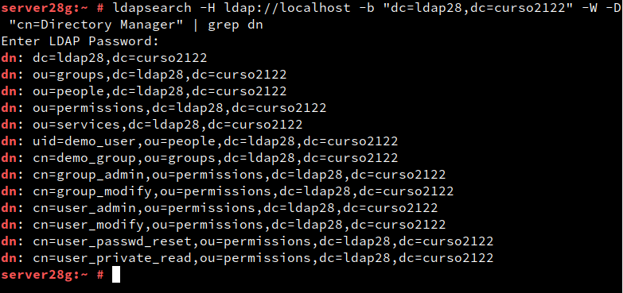
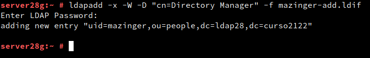
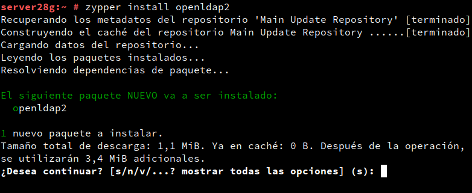

# Servidor LDAP.

## Prerequisitos.

### FQDN (Fully Qualified Domain Name).

Debemos de configurar el hostname de la máquina para que su FQDN sea **server28g.curso2122**.

Para ello debemos de ir a ``Yast → Ajustes de Red → Descripcion general → Conexion existente → Nombre del host`` y cambiamos el valor por defecto (localhost) por el valor que queremos (server28g.curso2122).

Comprobamos que los cambios se ha realizado correctamente comprobamos los siguientes elementos:
* Fichero /etc/hosts

* Fichero /etc/hostname

* Comando hostname -a/-d/-f

## Instalación del Servidor LDAP.

### Instalación del paquete.

Para configurar el servidor LDAP debemos de instalar el paquete **389-ds**.

Comprobamos su version.

### Configuración de la instancia.

Ahora creamos un archivo /root/instance.inf que servirá como fichero de configuración del servidor LDAP.

Ahora validamos el fichero como archivo de configuración del servidor LDAP.

Vemos que el servicio se encuentra activo.

Ahora creamos un fichero /root/.dsrc de que administrará los permisos para acceder a la base de datos como administrador. El contenido es el siguiente

### Comprobar el servicio.

Comprobamos el estado del servicio.

### Comprobar acceso al contenido de LDAP.

Desde la máquina real comprobamos el acceso al servidor LDAP ejecutando la herramienta nmap y filtrando los puertos que nos interesan.

Como no podemos acceder significa que el cortafuegos de la máquina servidor no permite el acceso a los puertos.  

Volvemos a comprobar el acceso y vemos que nos permite ver los puertos ahora, sin embargo no funciona con el hostname, por lo que usamos la IP.

Ahora vemos el contenido de nuestra base de datos LDAP.

Ahora vemos el contenido de la base de datos LDAP como usuario administrador.

## Añadir usuarios LDAP por comandos.

### Buscar Unidades Organizativas.

Comprobamos que las unidades organizativas people y groups existen.

### Agregar usuarios.

Empezamos creando un fichero de configuración del usuario para luego validarlo.

Ahora ejecutamos el comando **ldapadd -x -W -D "cn=Directory Manager" -f mazinger-add.ldif** para validar el usuario.

### Comprobar nuevo usuario.

Comprobamos la existencia del usuario que acabamos de crear.

## Contraseñas encriptadas.

### Herramienta slappasswd.

Debemos de instalar el paquete **openldap2** para cambiar las contraseñas.

Ahora podemos generar contraseñas cifradas con diferentes formatos, aquí un ejemplo de como generar una contraseña encriptada.

### Agregar más usuarios con claves encriptadas.

Ahora vamos a crear 3 ficheros para 3 usuarios nuevos:
* **zoro**

* **sanji**

* **chopper**

Ahora validamos estos usuarios.

### Comprobar los usuarios creados.

Ahora comprobamos que los usuarios existen.

Ahora comprobamos que los usuarios son accesibles desde una máquina cliente.

