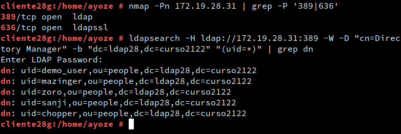
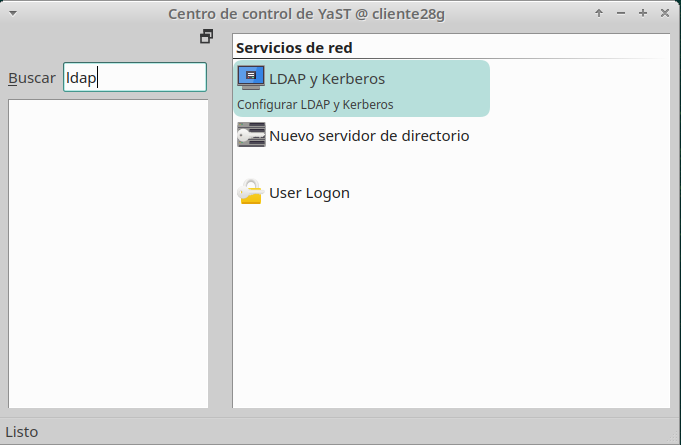
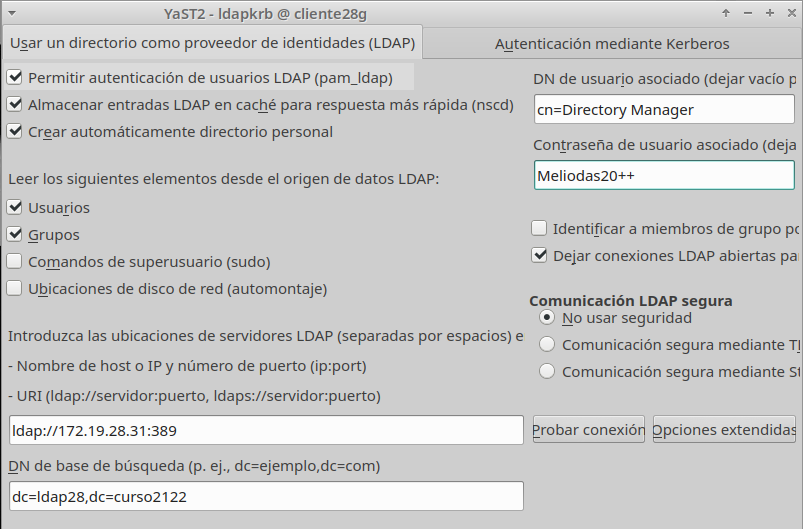
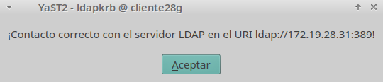
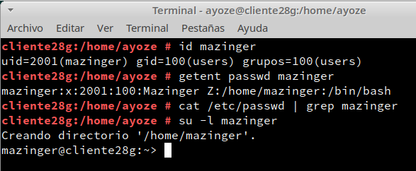
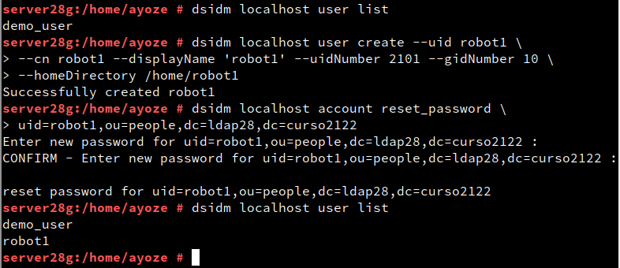
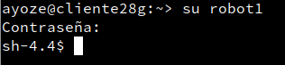
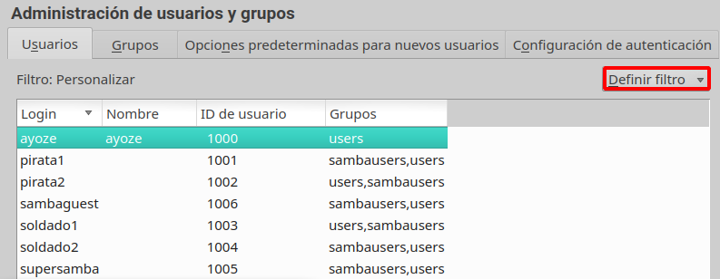
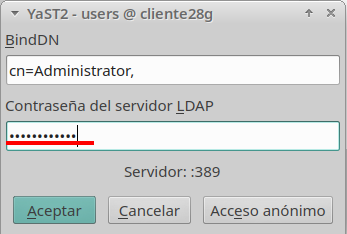

# Cliente para autenticación LDAP.

## Preparativos.

Desde la máquina cliente comprobamos que hay conexión a la máquina servidor.

### Crear conexión con el servidor.

Desde la herramienta de LDAP y Kerberos dentro de Yast podemos crear una conexión a nuestro servidor LDAP.

Ahora debemos de rellenar la ventana emergente con los datos adecuados.

Los datos que debemos de introducir son:

* **Ip-del-servidor:389** (puerto de acceso al servidor LDAP).

* **BaseDN: (dc=ldap28,dc=curso2122)**.

* DN de usuario: **cn=Directory Manager**

* **Contraseña del usuario Directory Manager**

Probamos la conexión y si es exitosa aplicamos cambios y salimos de esa ventana.

### Comprobar con comandos.

Desde la máquina cliente comprobamos que estamos conectados ejecutando los comandos de la imagen para comprobar el usuario remoto mazinger y entrar como mazinger al sistema.

## Crear usuarios usando otros comandos.

Mostramos un listado de usuarios LDAP dentro de la máquina cliente y creamos un usuario **robot1** y añadimos su contraseña.

Entramos como usuario robot1

## Usando Yast.

### Crear usuario LDAP usando Yast.

Ahora procedería la creación de usuarios de forma remota, pero nos da error con el proceso LDAP.init, por lo que la práctica llega hasta aquí por el momento.

