#

## Comprobar versiones de vagrant

Para empezar a realizar la practica debemos comprobar que tenemos la utilidad de vagrant instalada en la maquina real, en caso contrario debemos de preguntar al administrador de la red para poder instalarlo.

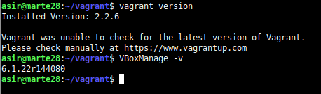

## Proyecto Celtics

Ahora empezamos importando una maquina externa **(ubuntu/bionic64)**.

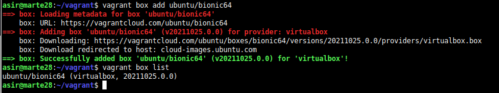

Ahora comprobamos creamos y nos movemos al directorio **vagrant28-celtics** que es donde realizaremos esta seccion de la práctica.

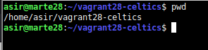

Creamos el fichero de configuración Vagrantfile para configurar la máquina que hemos importado, en este añadimos el **nombre de la máquina a configurar**, **el hostname** que queremos que tenga y el programa con el que se va a abrir la máquina (**VBOX**).

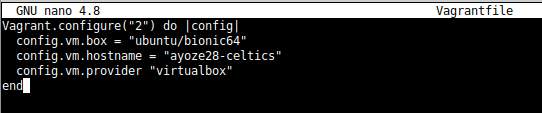

Ejecutamos el comando **vagrant up** para activar y encender la máquina.

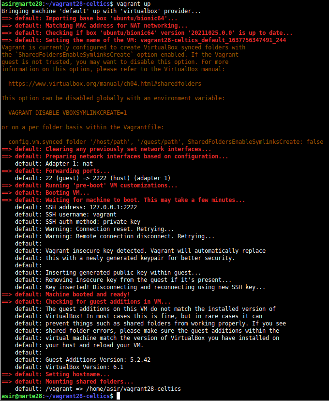

Ahora accedemos a ella con vagrant ssh

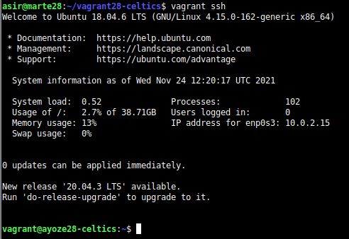

Ahora hacemos un par de comprobaciones sencillas.

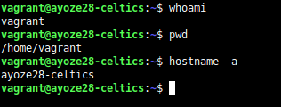


```
DE INTERÉS:

· Para salir de la maquina se ejecuta el comando exit.

· Para apagar la máquina se debe de ejecutar el comando vagrant
halt.

· Para eliminar la máquina ejecutamos vagrant destroy
```


## Proyecto Hawks

Ahora debemos crear otro directorio llamado vagrant28-hawks para la elaboración de otra máquina virtual y dentro de este otro fichero de configuración Vagrantfile exactamente igual al anterior, pero añadimos la ultima linea que habilita el protocolo http por el puerto 4567 del host que será enrutado al puerto 80 de la máquina vagrant28-hawks.

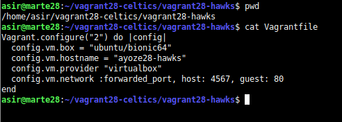

Ejecutamos un vagrant up para activar y encender la máquina

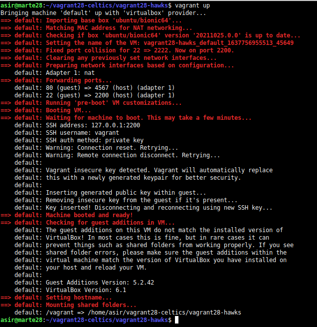

Nos conectamos a la maquina y hacemos un par de comprobaciones.

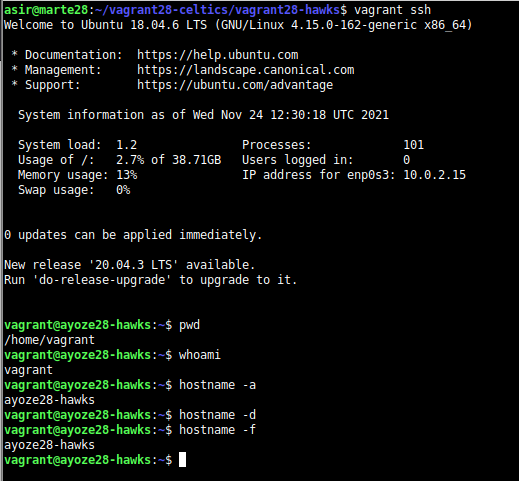

Ahora estando dentro de la maquina instalamos **apache2** y desde la maquina real comprobamos que podemos acceder por el puerto 4567 a la página de apache2 de la máquina vagrant28-hawks

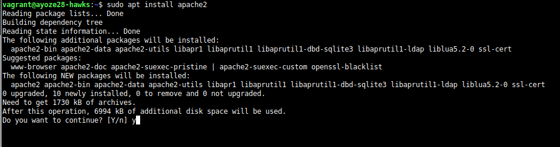

Vemos que está abierto el puerto con **vagrant port**.

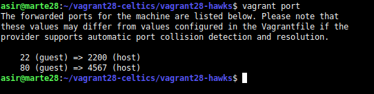

Comprobamos el acceso con la dirección: http://127.0.0.1:4567 en el navegador.


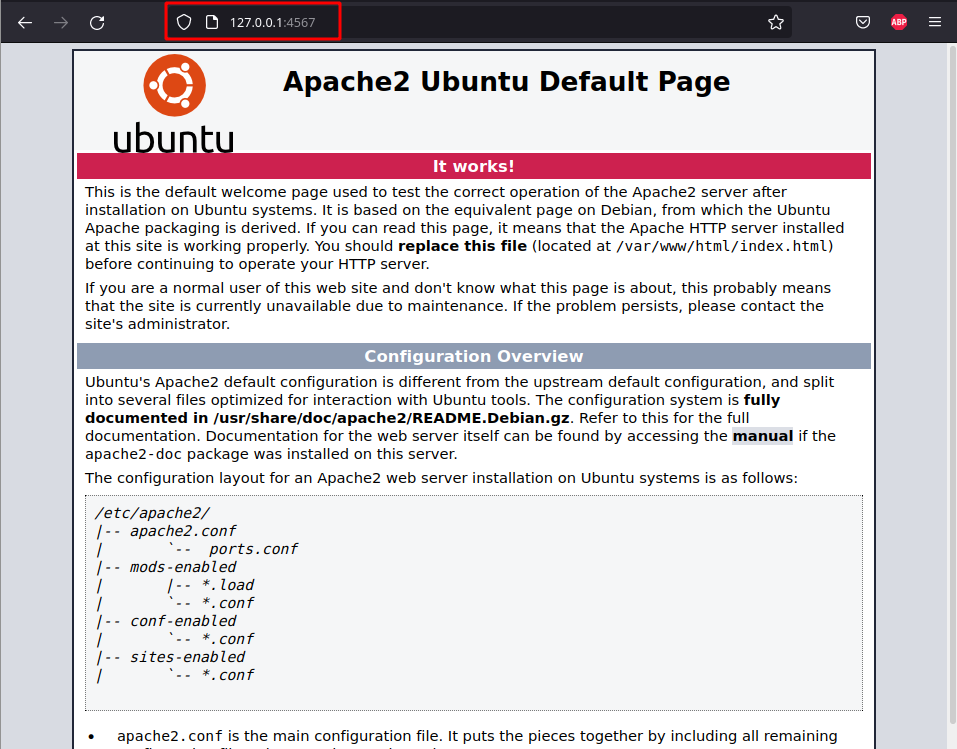

## Suministro

Ahora debemos de apagar la máquina hawks y destruirla.

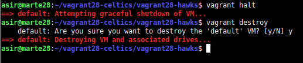

### Proyecto Lakers.

Ahora creamos el proyecto lakers dentro del directorio vagrant28-lakers y además creamos el directorio html con un index.html dentro del mismo.

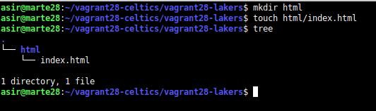

Aquí un vistazo del html.

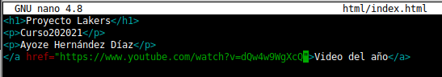

Creamos un fichero install_apache2 para que el apache2 se instale de manera automática al encender la máquina.

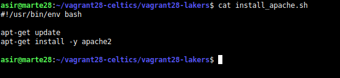

Ahora añadimos un fichero Vagrantfile con la misma configuración de antes y añadimos 2 líneas nuevas:

* config.vm.provision :shell, :path => "install_apache.sh"  **Añadimos el fichero install_apache.sh a la configuración de la máquina para que se ejecute al iniciarse**

* config.vm.synced_folder "html", "/var/www/html" **Sincronizamos la carpeta /var/www/html de la máquina vagrant y la real**.

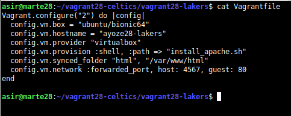

Activamos la máquina y vemos que se instala apache2.

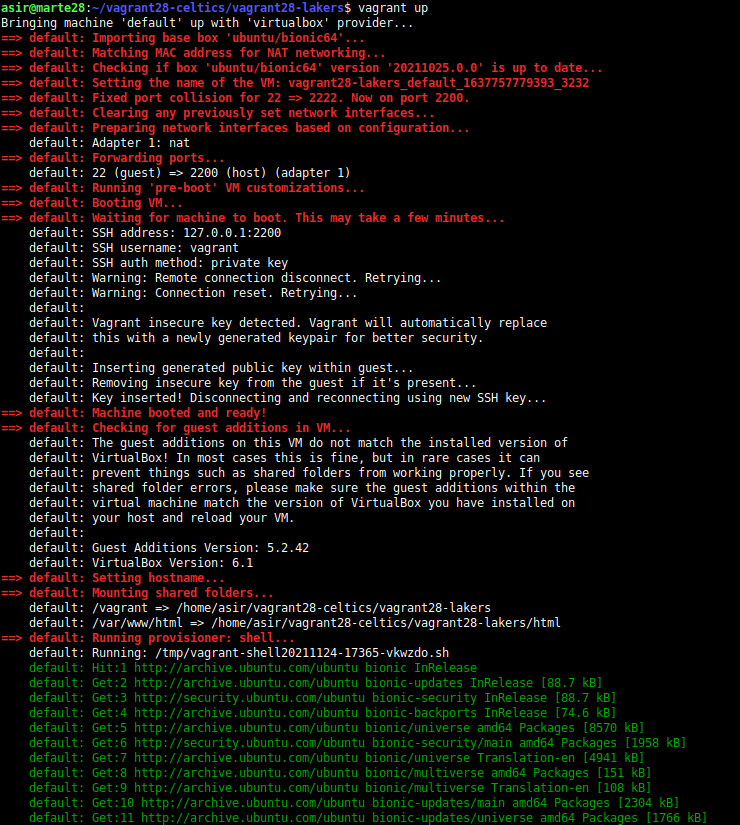

Vemos que ahora el fichero index.html que creamos se puede ver por la misma url de antes.

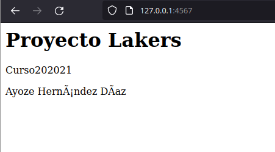

## Proyecto Raptors

Creamos el directorio vagrant28-raptors y añadimos el fichero Vagrantfile con las siguientes lineas extra:

* config.vm.provision "shell", inline: "sudo apt-get update && sudo apt-get install -y puppet" **Se instala puppet el la máquina antes de que se pueda usar**
* ```
    config.vm.provision "puppet" do |puppet|
    puppet.manifest_file = "ayoze28.pp"
   end
 end
 ```
* **Hacemos aprovisionamiento con puppet** con el cuadro de comandos anterior, se consultará e fichero manifests/ayoze28.pp por lo que habrá que crearlo.

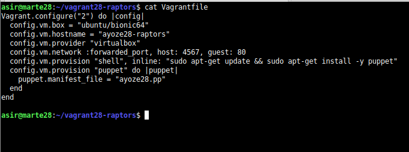

Creamos un fichero **manifests/ayoze28.pp** que especifique el programa que queremos instalar

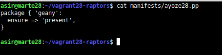

Activamos la máquina

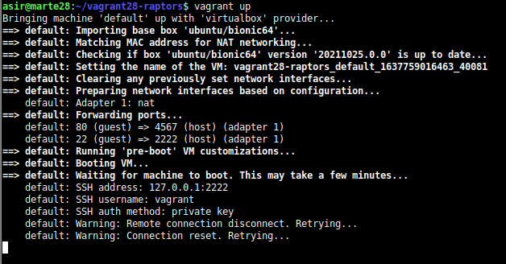


* Con la máquina encendida

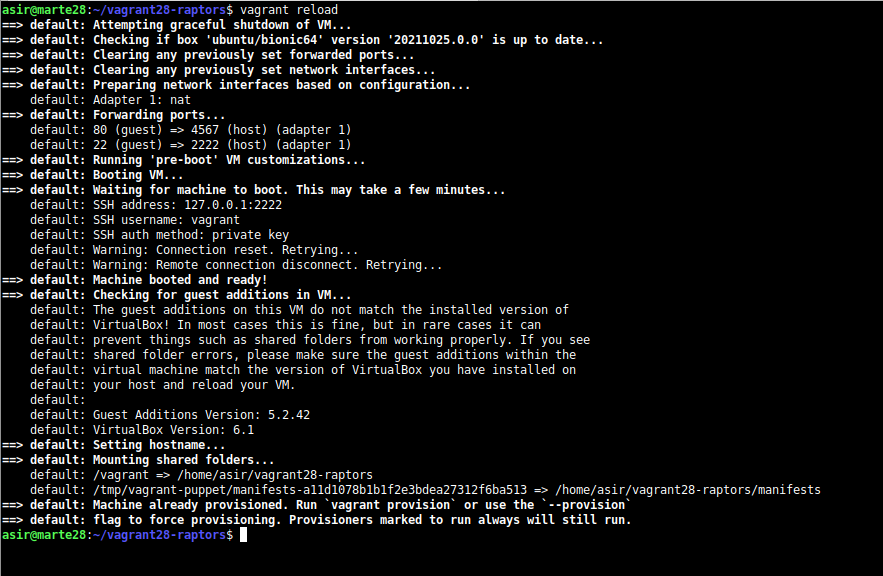

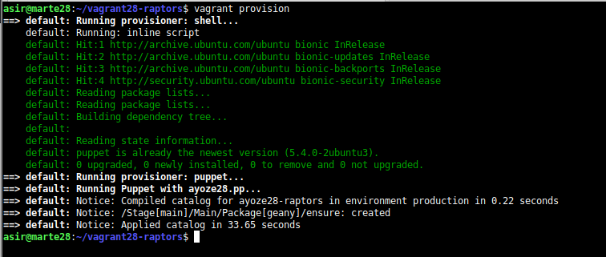

* Con la máquina apagada

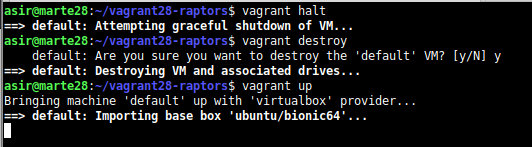

## Proyecto Bulls (MI CAJA)

Ahora vamos a crear nuestra propia caja o BOX, para ello debemos de usar una máquina virtual ya creada, empezamos configurando la interfaz de red en modo DHCP y nos aseguramos de que tenga un hostname apropiado y que tenga algunos paquetes previamente instalados (openssh-server). Además deberemos de crear en la máquina real un directorio vagrant28-bulls.

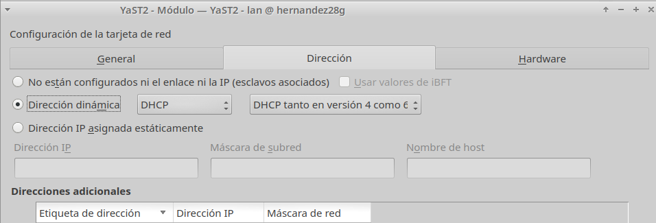

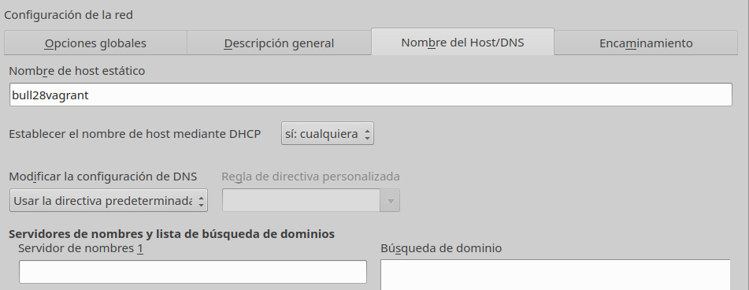

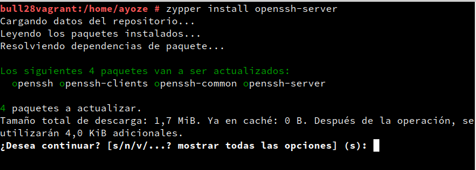

Creamos el usuario vagrant y le ponemos de contraseña vagrant

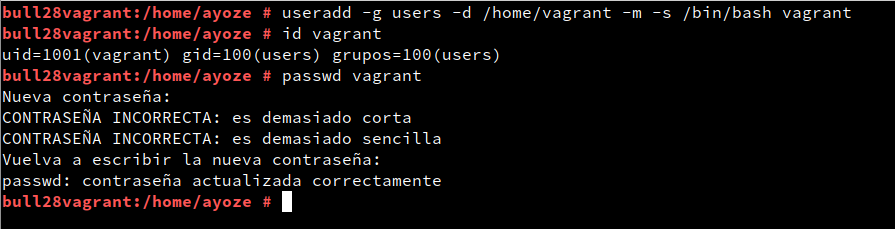

Cambiamos la contraseña del root también a vagrant.


Ahora nos descargamos una clave pública para configurar el acceso mediante clave pública al usuario vagrant.

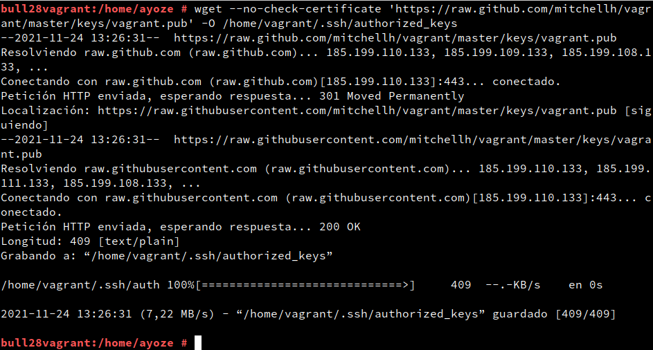

Ahora cambiamos los permisos de la clave que acabamos de importar.

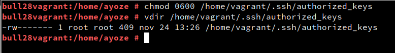

Cambiamos también el propietario de la carpeta .ssh dentro de /home/vagrant/ a vagrant en vez de root.

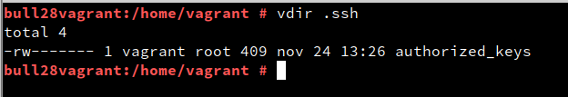

Añadimos a vagrant como usurio sudoer.

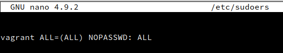

Comprobamos que tenemos las guest additions instaladas.

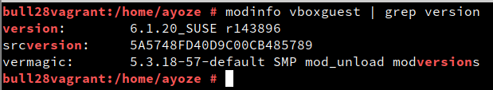

Ahora vemos un listado de las máquinas virtuales que tenemos desde el terminal con el comando **VBoxManage list vms**.

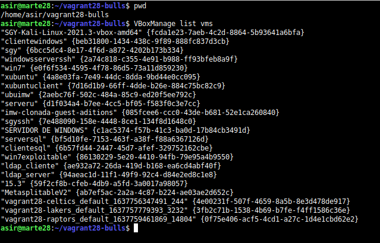

Ahora creamos nuestra caja a partir de la máquina que estabamos configurando (15.3) como ayoze28.box

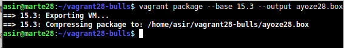

Ahora añadimos la máquina a la lista de máquinas vagrant importadas.

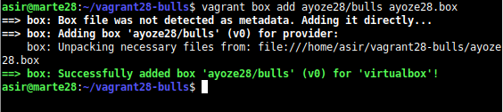

Comprobamos esta lista.

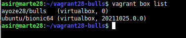

Creamos y cnfiguramos un fichero básico Vagrantfile

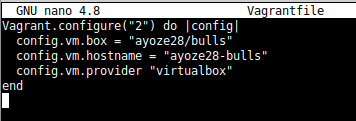

Activamos la máquina.

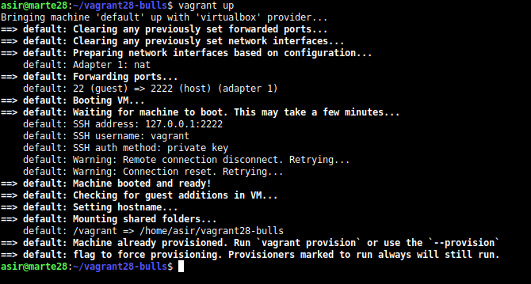

Nos conectamos a esta y realizamos algunas comprobaciones.

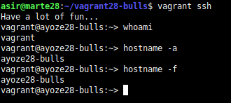

Hacemos un listado de las máquinas que tenemos y eliminamos la máquina vagrant que nosotros creamos.

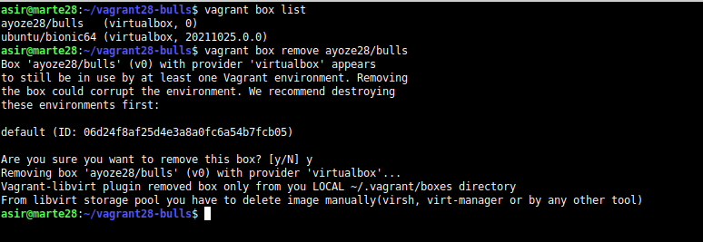
