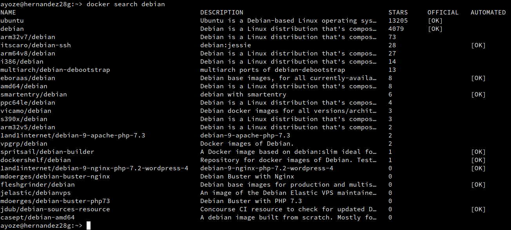
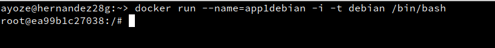
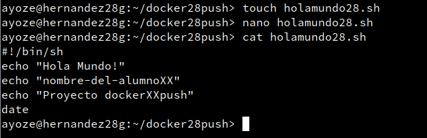

# Docker.

## Contenedores con Docker.

### Instalación.

Empezamos con la instalación de la herramienta Docker.


Comprobamos con **systemctl status docker** su estado, y en caso de no estar activo lo activamos.


Comprobamos que el **Ip Forwarding** está activo, es decir, que su valor sea 1.


### Primera prueba.

Para poder usar esta herramienta debemos de estar dentro del grupo docker, por lo que nos añadimos a ese grupo y comprobamos que pertenecemos al grupo, después de esto es recomendable un reinicio del sistema.

**Ya no hace falta estar en modo superusuario**


Comprobamos la version de Docker con **docker versión**.


Ejecutamos el comando docker run hello-world, que hace lo siguiente:

* Busca si hay una imagen llamada hello-world dentro del sistema, en caso de que no la haya la descarga.

* Crea un contenedor

* Ejecuta la imagen.


Ejecutamos docker images para ver las imágenes que hay dentro del sistema y vemos que ahora si aparece hello-world.


Eliminamos la imagen que tiene el ID=163149b013d3. y comprobamos que ahora no hay imagenes con ese ID.


### Alias.

Creamos un fichero .alias en **/home/ayoze/.alias**. Lo que ahora podemos hacer es hacer los comandos más pequeños, por ejemplo, ```di``` equivale a ```docker images```.


## Creación manual de nuestra imagen.

### Crear un contenedor manualmente.

Ahora buscamos una imagen ```debian``` dentro de los servidores de docker.



Ahora nos descargamos la imagen con ```docker pull debian```. Comprobamos que tenemos la imagen con ```docker images``` o ```di```.


Ahora creamos un contenedor y lo ejecutamos con **docker run --name=app1debian -i -t /bin/bash**.



Lo que cada parámetro del comando significa:

* docker run: Crea y ejecuta el contenedor.

* --name=app1debian: le da un nombre al contenedor (app1debian).

* -i: Abre una sesión con la que se pueda interactuar.

* -t: Especifica la imagen que se va a usar.

* /bin/bash: Esta es la app que se va a ejecutar.

### Personalizar el contenedor.

Ahora comprobamos que estamos en debian con cat /etc/motd


Actualizamos el sistema


Instalamos la herramienta Nginx con **apt install -y nginx**. (-y ignora todos las preguntas y las rellena con las opciones por defecto).


Instalamos la herramienta de edicion de texto **vim** (el documento del profesor fue actualizado para instalar nano).


Creamos el fichero **holamundo1.html** dentro de **/var/www/html** con algo de contenido.


Creamos el archivo /root/server.sh para que el servicio de Nginx no se apague nunca.


Otorgamos permisos de ejecución a este fichero y comprobamos.


### Crear una imagen a partir de un contenedor.

Con **docker commit app1debian ayoze28/nginx1** creamos nuestra imagen a partir de un contenedor que ya existía y que modificamos.


Paramos y eliminamos la imagen app1debian y comprobamos que ya no está en ejecución con **docker ps -a**.


## Crear un contenedor a partir de nuestra imagen.

### Crear un contenedor con Nginx.

Ejecutamos el contenedor que habiamos creado abriendo el puerto **80** del contenedor.


### Comprobación.

Al ejecutar docker ps podemos ver una columna que nos indica el puerto real del contenedor, en este caso 49153 (el **puerto 49153** de la **máquina real** equivale al **puerto 80 del contenedor**).


Nos dirigimos a un navegador con la terminal aún abierta y entramos a la página **0.0.0.0/49153**.


Ahora probamos con **0.0.0.0/49153/holamundo1.html**.


Paramos la imagen y vemos que no está en ejecución.


Eliminamos la imagen y comprobamos que ya no existe.


### Migrar la imagen a otra máquina.

Ahora vamos a exportar nuestra imagen a otra máquina.


Cargamos la imagen de la compañera **Eufemia** y vemos que imágenes están en ejecución.


## Dockerfile.

### Preparación de ficheros.

Dentro del directorio **/var/www/html** creamos otro **holamundo2.html** con contenido diferente al anterior.


Creamos además el directorio **/home/ayoze/docker28local** y creamos un fichero **Dockerfile** para configurar un par de parámetros que se ejecutarán cuando el contenedor que vamos a crear se cree.


* Se actualizará el contenedor, instalará nginx y apt-utils

* Se copiará el holamundo2 de /var/www/html y se le cambiarán los permisos a 666

* El puerto 80 estaá abierto

* El comando **/usr/sbin/nginx -g daemon off** se ejecutará para que nginx no se pare nunca

### Crear una imagen a partir de un Dockerfile.

Construimos la imagen con **docker build**.


Comprobamos que la imagen está creada con **docker images**.


### Crear contenedor y comprobar.

Con el comando **docker run --name=app4nginx2 -p 8082:80 -t ayoze28/nginx2** creamos un contenedor.


Vamos al sitio web **localhost:8082** y a **localhost:8082/holamundo2.html** y vemos que los 2 sitios funcionan.


### Usar imagenes ya creadas.

Creamos los ficheros **holamundo3.html** en **/var/www/html** y **Dockerfile** en **/home/ayoze/docker28web** con los contenidos que se especifican en las imágenes.


Ahora creamos la imagen **ayoze28/nginx3**.


Ejecutamos el contenedor.


Comprobamos el funcionamiento del mismo.


## Docker Hub.

### Creación de ficheros necesarios.

Creamos el fichero **/home/ayoze/docker28push/holamundo28.sh** con el contenido señalado en la imagen.



Creamos un Dockerfile con la configuración siguiente.


Construimos la imagen y la ejecutamos.


### Subida de imagen a Docker Hub.

Vemos los archivos que tenemos y buscamos la imagen que acabamos de construir.


Nos registramos en dockerhub (mi usuario es payito) y ejecutamos el comando docker login y docker tag para subir la imagen.


## Limpiar contenedores e imágenes

Ahora debemos de eliminar todas las imágenes del sistema.


