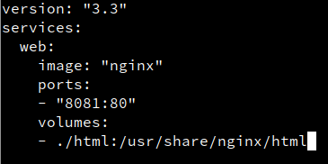
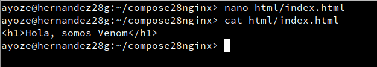
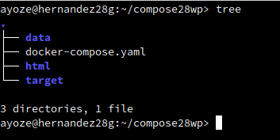
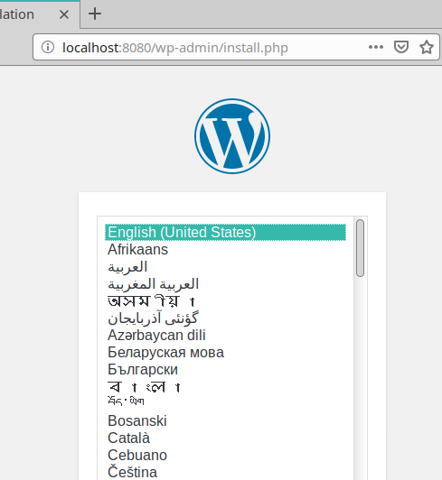

# Gestión de contenedores con docker 

***Nombre:*** Ayoze Hernández Díaz.

***Curso:*** 2º de Ciclo Superior de Administración de Sistemas Informáticos en Red.

## ÍNDICE

+ [Gestión de contenedores con docker](#docker)
+ [Instalación](#Punto1)
+ [Gestión de un contenedor](#Punto2)
+ [Descargar imagen](#Punto3)
+ [Gestionar Nginx con volumen](#Punto4)
+ [Cambios en caliente](#Punto5)
+ [Gestionar un contenedor Mysql con volumen](#Punto6)
+ [Gestionar dos contenedores](#Punto7)

### ***Instalación***. 

Descargamos docker-compose con **zypper in docker-compose**.

Comprobamos la version de docker-compose con **docker-compose -v**.

### ***Gestión de un contenedor***. 

#### ***Descargar imagen***. 

Comprobamos que no tenemos ninguna imagen descargada y buscamos una que contenga nginx con **docker search nginx**.

Descargamos la imagen con **docker pull nginx**.

Vemos que la imagen ahora está en nuestro sistema.

#### ***Gestionar Nginx con volumen***. 

Creamos la carpeta **/home/ayoze/compose28nginx** con la siguiente estructura.

Editamos el fichero **docker-compose.yaml**.

* web - Especifica que tipo de imagen es.
* image - Especifica la imagen que se va a usar.
* ports - Especifica los puertos **target** y **expose**.
* volumes - Especifica la equivalencia de una carpeta dentro del contenedor a una del sistema.

Vemos las imagenes que tenemos en ejecución y levantamos el contenedor.

Vemos de nuevo el estado del contenedor.

Editamos un indice dentro del contenedor para mostrarlo en el navegador.

Entramos a **localhost:8081** y vemos lo que añadimos en el indice.

Volvemos añadimos a añadir otra línea y recargamos la página.

Vemos los cambios.

#### ***Cambios en caliente***. 

Ejecutamos **dc down** para apagar los contenedores y vemos que el terminal 1 ya se liberó.

* **Terminal 2**

* **Terminal 1**

#### ***Gestionar un contenedor Mysql con volumen***. 

Descargamos la imagen oficial de **mysql**.

Miramos las imágenes que tenemos.

**A partir de aquí no pude avanzar**

En las 3 siguientes imagenes muestro las 3 configuraciones diferentes que he adoptado para intentar ejecutar exitosamente este punto de la práctica.

Instalamos un cliente de **mysql** en la máquina.

Ahora vemos los contenedores que tenemos el contenedor activo.

Ejecutamos un nmap localhost para ver que el servicio de mysql está abierto.

Vemos que desde la máquina real no está abierto.

Y además vemos que tampoco nos deja conectarnos.

### ***Gestionar dos contenedores***. 

Ahora descargamos 2 imágenes:

* **Wordpress**
* **Mariadb**

Aquí está el fichero de configuración que usaremos para levantar los contenedores.

* Cambié el **WORDPRESS_DB_HOST=host** por **WORDPRESS_DB_HOST=db**.
* Cambié **data:/var/lib/mysql** por **./data:/var/lib/mysql**.

Creamos la siguiente estructura de carpetas dentro de la nueva carpeta **compose28wp**.

Iniciamos los contenedores.

Entramos dentro de **localhost:8080** y accedemos a **Wordpress**.

