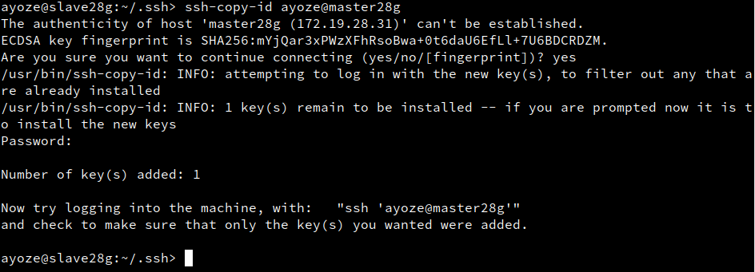
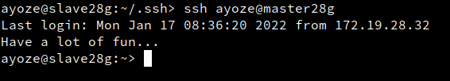
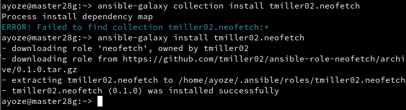

<center>

# Instalación y configuración de Ansible


</center>

***Nombre:***
***Curso:*** 2º de Ciclo Superior de Administración de Sistemas Informáticos en Red.

### ÍNDICE

+ [Instalación de ansible](#id1)
+ [Objetivos](#id2)
+ [Material empleado](#id3)
+ [Desarrollo](#id4)
+ [Conclusiones](#id5)


#### ***Instalación de ansible***. <a name="id1"></a>

Para instalar ansible ejecutamos **sudo zypper install ansible**.


Ahora debemos de modificar el fichero que contiene información de los hosts relacionados con ansible en **/etc/ansible/hosts** y añadimos las máquinas de Windows 10 y de OpenSuse, además añadimos un par de variables que nos harán falta:

```
IMPORTANTE: se deben de añadi comillas en la ansible_password si contiene números o caracteres.
```

* **ansible_user= ayoze**
* **ansible_password= "1234"**
* **ansible_port= 5985**
* **ansible_connection= winrm**
* **ansible_winrm_transport= basic**
* **ansible_winrm_server_cert_validation= ignore**

Y debería quedar algo así


#### ***Acceso vía ssh***. <a name="id2"></a>

Generamos un par de claves nuevas en el cliente con el comando **ssh-keygen -t rsa**.


Ahora pasamos la clave al servidor, y realizamos lo mismo desde el servidor al cliente.



Probamos la conexión y vemos que no nos pide contraseña.



Para el caso de Windows hay que comprobar varias cosas:

* El servicio de Openssh está activo
* La característica de Openssh server (Beta) está instalada
* Crear un archivo **windows.pub** dentro de la carpeta **C:\ProgramData\ssh**
* Crear un archivo **authorized_keys** dentro de la carpeta **C:\ProgramData\ssh**
* Generar la clave en el master de OpenSuse y copiarla en los 2 ficheros anteriores

Después de esto probamos a conectarnos por ssh y vemos que nos deja ahora.


#### ***Comprobar conexión entre máquinas mediante ping en ansible***. <a name="id3"></a>


Realizamos el ping entre máquinas master y slaves con:

* **ansible slave28w -m win_ping**
* **ansible slave28g -m ping**

Instalamos el neofetch y el winfetch (equivalente para Windows) con comandos ad-hock.

  * Opensuse:


  * Comprobamos que se ha instalado.


  * Windows:

Para el windows nos hace falta configurar el componente de winrm (Windows Remote Conection), elegimos los parámetros por defecto.


Permitimos las conexiones desencriptadas y deshabilitamos el uso de contraseñas por ssh.


Instalamos un "plugin" o paquete adicional de ansible para la gestión de las conexiones remotas con Windows. (Después de este punto se pudo hacer ping entre OpenSuse y Windows)



Ahora podemos probar a instalar el winfetch con chocolatey.  


Ejecutamos como administrador el cmd y ejecutamos **winfetch**


#### ***Ansible playbooks***. <a name="id4"></a>

Creamos un fichero **tarea-41-ping.yaml** que servirá como playbook con el siguiente contenido.

```
---

- hosts:
    - slave28g
  tasks:
    - ping:
- hosts:
    - slave28w
  tasks:
    - win_ping:

```
Lo ejecutamos.


Creamos un fichero **tarea-42-install.yaml** que servirá como playbook con el siguiente contenido.

```
---

- hosts:
    - slave28g
  tasks:
    - name :
      zypper: name=neofetch state=present
    - name :
      zypper: name=geany state=present
    - name :
      zypper: name=vlc state=present
```
Lo ejecutamos.


Creamos un fichero **tarea-43-uninstall.yaml** que servirá como playbook con el siguiente contenido.

```
---

- hosts:
    - slave28g
  tasks:
    - name:
      zypper: name=neofetch state=absent
    - name:
      zypper: name=geany state=absent
    - name:
      zypper: name=vlc state=absent
```

(Ejecuto el fichero tarea-43-install.yaml, fallo mío)


#### ***Ansible handlers***. <a name="id5"></a>

Los handlers son tareas que solo se ejecutan cuando la tarea anterior es ejecutada con éxito.

Creamos un fichero **tarea-51-apache-on.yaml** que servirá como playbook con el siguiente contenido.


```
---

- hosts:
    - slave28g
  remote_user: ayoze
  gather_facts: true
  tasks:
    - name:
      zypper: name=apache2 state=present
  handlers:
    - name:
      service: name=apache2 state=started
```


Creamos un fichero **tarea-52-apache-off.yaml** que servirá como playbook con el siguiente contenido.

```
---

- hosts:
    - slave28g
  remote_user: ayoze
  gather_facts: true
  tasks:
    - name:
      service: name=apache2 state=stopped
  handlers:
    - name:
      zypper: name=apache2 state=absent
```


