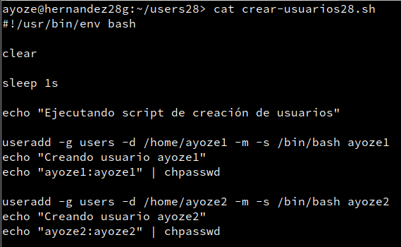
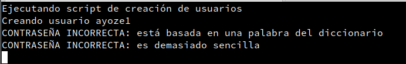
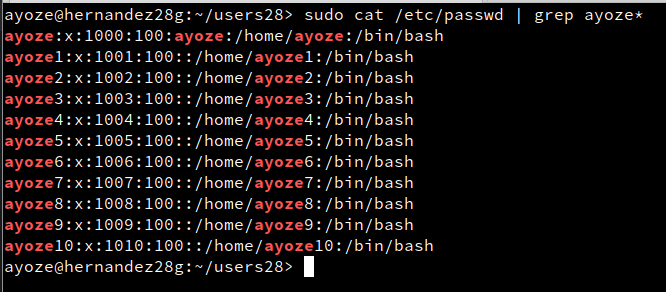
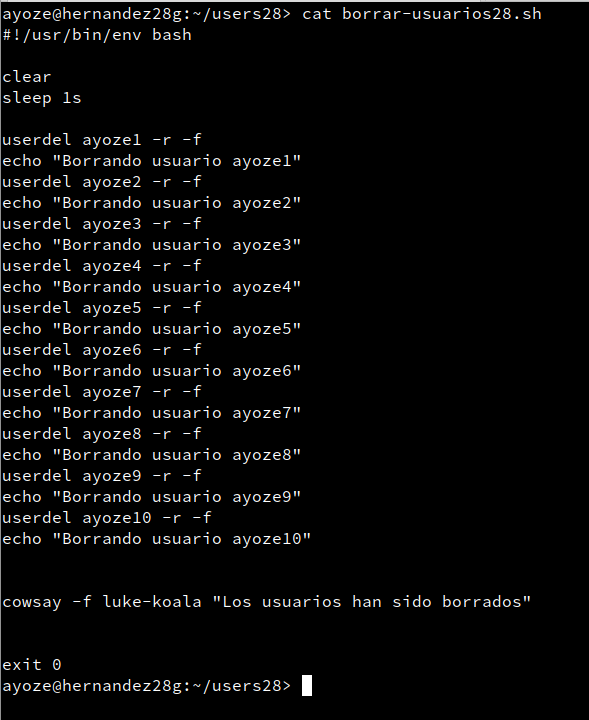
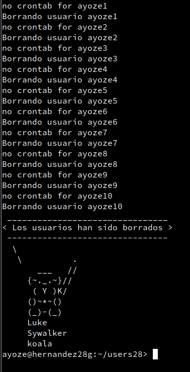
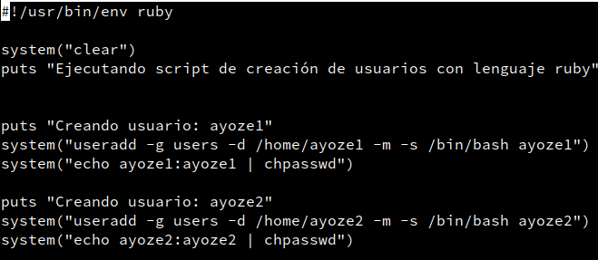
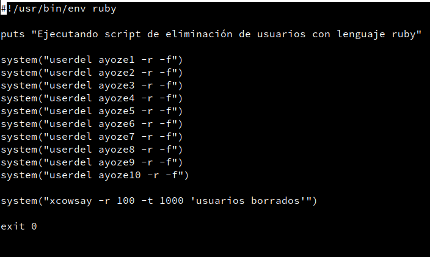
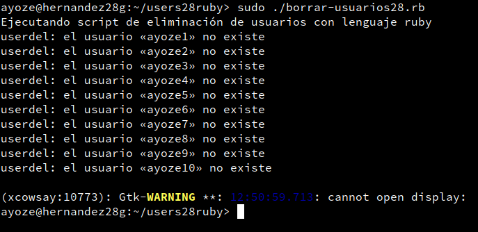
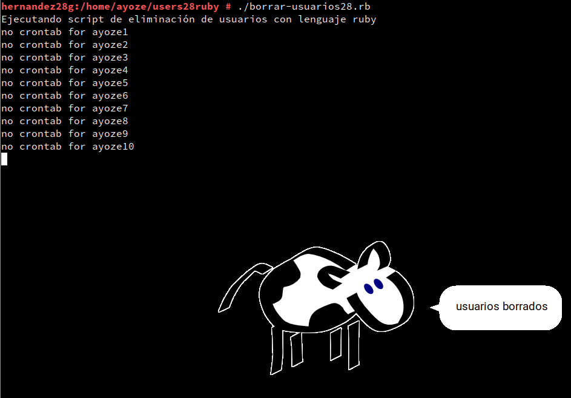

# Scripting secuencial

***Nombre:*** Ayoze Hernández Díaz
***Curso:*** 2º de Ciclo Superior de Administración de Sistemas Informáticos en Red.

### ÍNDICE

+ [Aclaraciones previas](#id1)
+ [Crear y borrar de usuarios con bash](#id2)
+ [Crear y borrar usuarios con ruby](#id3)

#### ***Aclaraciones previas***. 

Esta práctica se ha realizado en Opensuse 15.3 con 2 entornos de desarrollo diferentes:

* Bash
* Ruby

A todos los ficheros se les ha aplicado el comando **chmod +x** para añadirles permisos de ejecución.

#### ***Crear y borrar de usuarios con bash***. 

Contenido del fichero "**crear-usuarios28.sh**":

Al ejecutar el archivo a la hora de ejecutarse la creación de usuario aparece lo siguiente, esto es debido a que "nombre-de-alumnox" no es una contraseña muy larga y es simple.

Ahora ejecutamos cat **"/etc/passwd | grep ayoze*"** para buscar dentro del fichero /etc/passwd cualquier coincidencia con ayoze y que continue con algo más.

Contenido del fichero "**borrar-usuarios28.sh**":

Debido a que bash acepta los comandos del sistema se le puede introducir directamente lo que queremos que haga.

#### ***Crear y borrar usuarios con ruby***. 

Contenido del fichero "**crear-usuarios28.rb**":

Contenido del fichero "**borrar-usuarios28.sh**":

Al ejecutar el fichero **"borrar-usuarios28.rb"** nos da un warning, este se soluciona ejecutando los siguientes comandos:

* **su -**
* **export DISPLAY=:0.0**
* **cd ruta-de-los-scripts**
* **xhost +**
* **xhost +IP-DE-LA-MÁQUINA**

Después de haber sido ejecutado aparece lo siguiente en pantalla

