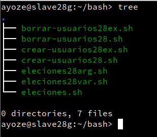
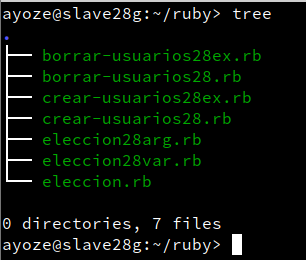
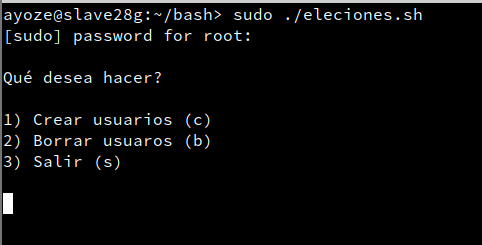
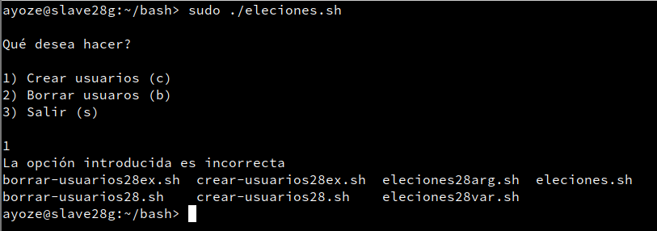
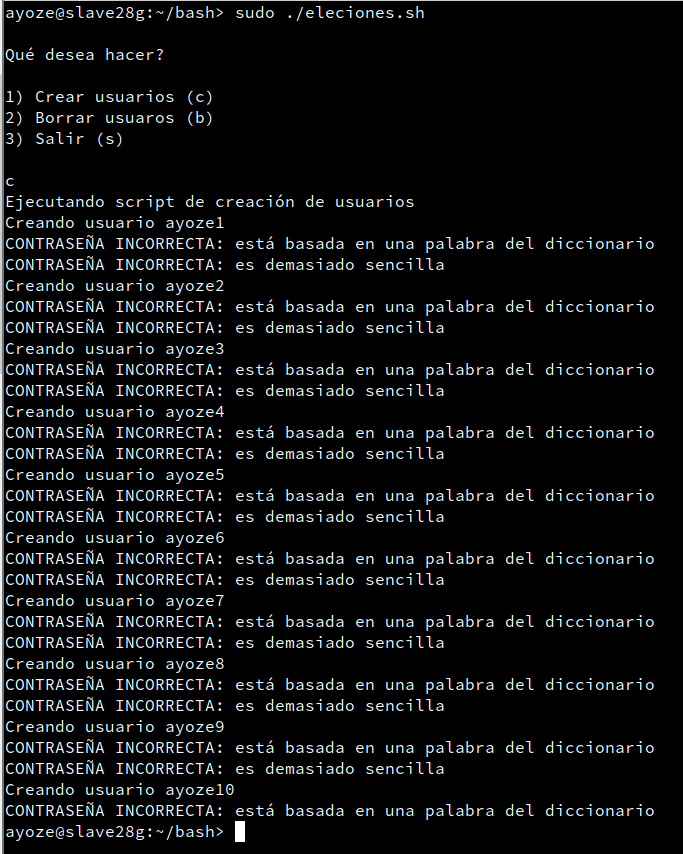
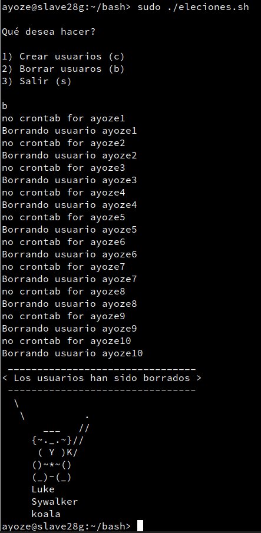
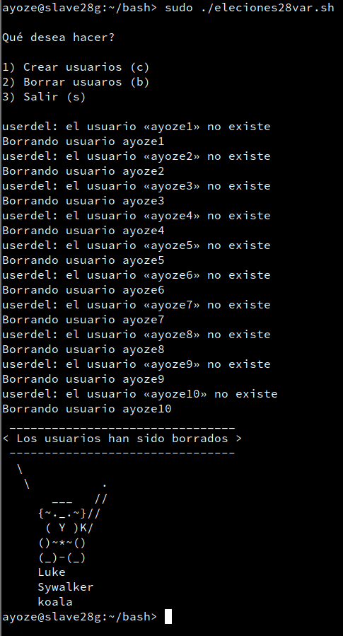
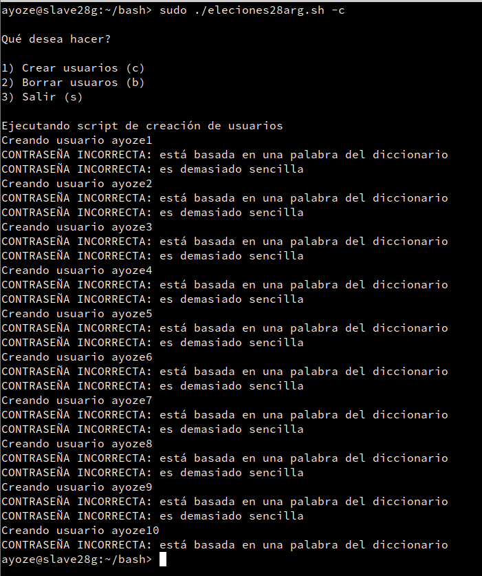
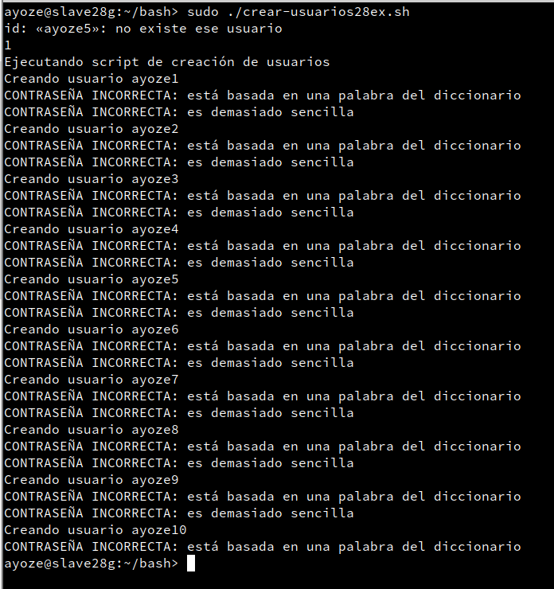
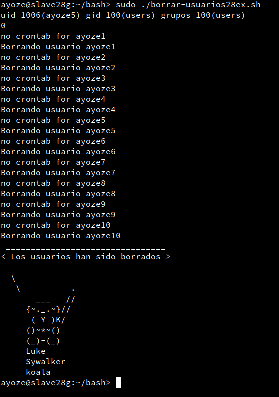

<center>

# TÍTULO DE LA PRÁCTICA


</center>

***Nombre:*** Ayoze Hernández Díaz
***Curso:*** 2º de Ciclo Superior de Administración de Sistemas Informáticos en Red.

### ÍNDICE
+ [Preparativos](#id0)
+ [Bash](#id1)
+ [Ruby](#id2)

## ***Preparativos***

Para realizar los scripts debemos de tener la siguiente estructura de carpetas y archivos.




## ***Bash***. <a name="id1"></a>

Scripts a realizar:

* **Script que admita entrada del usuario para elegir una opción**
* **Script que tenga una variable predefinida dentro del fichero como opción por defecto**
* **Script que admita parámetros mediante la línea de comandos para elegir una opción**
* **Script que compruebe si los usuarios están creados y los elimine en caso negativo**
* **Script que compruebe si los usuarios están creados y los elimine en caso positivo**

**Script 1**

Este script muestra un menú que te deja elegir entre 3 opciones:

* Crear usuarios (c)
* Borrar usuarios	(b)
* Salir		(s)

Lo que hace es abrir el archivo correspondiente y lo ejecuta de la práctica anterior según la opción elegida.

Código:

```
#!/usr/bin/env bash

echo "
Qué desea hacer?

1) Crear usuarios (c)
2) Borrar usuaros (b)
3) Salir (s)
"

read OPTION

if [ "$OPTION" = "c" ]; then
    bash /home/ayoze/users28/crear-usuarios28.sh
elif [ "$OPTION" = "b" ]; then
    bash /home/ayoze/users28/borrar-usuarios28.sh
elif [ "$OPTION" = "s" ]; then
    echo "Saliendo del programa"
    exit 0
else
    echo "La opción introducida es incorrecta"
    ls
    exit 1
fi

```

Resultado:



Introducimos una opción no registrado.



Elegimos una opción (c) para crear usuarios.



Elegimos una opción (b) para borrar usuarios.




**Script 2**

Realiza lo mismo que el anterior, lo único que no te da la opción de elegir que quieres que se realice ya que tiene por defecto una opción predefinida.

```
#!/usr/bin/env bash

echo "
Qué desea hacer?

1) Crear usuarios (c)
2) Borrar usuaros (b)
3) Salir (s)
"

OPTION="b"

if [ "$OPTION" == "c" ]; then
    bash /home/ayoze/users28/crear-usuarios28.sh
elif [ "$OPTION" = "b" ]; then
    bash /home/ayoze/users28/borrar-usuarios28.sh
    exit 0
elif [ "$OPTION" = "s" ]; then
    echo "Saliendo del programa"
    exit 0
else
    echo "La opción introducida es incorrecta"
    ls
    exit 1
fi
```

Ejecutamos el fichero y como por defecto tenemos la b nos borra los usuarios



**Script 3**

Realiza lo mismo que el primer programa, pero acepta las ordenes mediante linea de comandos, es decir, su ejecución debe ser algo así:

* **sudo /home/nombre-alumno/ruta-fichero/nombre-fichero -c** Para crear usuarios
* **sudo /home/nombre-alumno/ruta-fichero/nombre-fichero -b** Para borrar usuarios
* **sudo /home/nombre-alumno/ruta-fichero/nombre-fichero -s** Para salir usuarios

```

#!/usr/bin/env bash

echo "Qué desea hacer?

1) Crear usuarios (c)
2) Borrar usuaros (b)
3) Salir (s)
"

if [ "$1" == "-c" ]; then
    bash /home/ayoze/users28/crear-usuarios28.sh
elif [ "$1" = "-b" ]; then
    bash /home/ayoze/users28/borrar-usuarios28.sh
    exit 0
elif [ "$1" = "-s" ]; then
    echo "Saliendo del programa"
    exit 0
else
    echo "La opción introducida es incorrecta"
    ls
    exit 1
fi

```

Ejecutamos el programa con el argumento **-c** para crear usuarios



**Script 4**

Crea los usuarios, pero comprueba primero que existe el ayoze1, ya que como es un script basado en un script secuencial que se ejecutaba de corrido, lo que significa que si la creación del primer usuario es exitosa, la de los demás también.

```
!/usr/bin/env bash

sleep 1s
id ayoze5
echo=$(echo $?)
echo $echo
if [ "$echo"="1" ]; then
    echo "Ejecutando script de creación de usuarios"

    useradd -g users -d /home/ayoze1 -m -s /bin/bash ayoze1
    echo "Creando usuario ayoze1"
    echo "ayoze1:ayoze1" | chpasswd

    echo "Creando usuario ayoze2"
    echo "ayoze2:ayoze2" | chpasswd

    useradd -g users -d /home/ayoze3 -m -s /bin/bash ayoze3
    echo "Creando usuario ayoze3"
    echo "ayoze3:ayoze3" | chpasswd

    useradd -g users -d /home/ayoze4 -m -s /bin/bash ayoze4
    echo "Creando usuario ayoze4"
    echo "ayoze4:ayoze4" | chpasswd

    useradd -g users -d /home/ayoze5 -m -s /bin/bash ayoze5
    echo "Creando usuario ayoze5"
    echo "ayoze5:ayoze5" | chpasswd

    useradd -g users -d /home/ayoze6 -m -s /bin/bash ayoze6
    echo "Creando usuario ayoze6"
    echo "ayoze6:ayoze6" | chpasswd

    useradd -g users -d /home/ayoze7 -m -s /bin/bash ayoze7
    echo "Creando usuario ayoze7"
    echo "ayoze7:ayoze7" | chpasswd

    useradd -g users -d /home/ayoze8 -m -s /bin/bash ayoze8
    echo "Creando usuario ayoze8"
    echo "ayoze8:ayoze8" | chpasswd

    useradd -g users -d /home/ayoze9 -m -s /bin/bash ayoze9
    echo "Creando usuario ayoze9"
    echo "ayoze9:ayoze9" | chpasswd

    useradd -g users -d /home/ayoze10 -m -s /bin/bash ayoze10
    echo "Creando usuario ayoze10"
    echo "ayoze10:ayoze10" | chpasswd
else
    echo "saliendo"
    exit 0
fi
```

Comprobamos que no existe el usuario ayoze5 como muestra el ejemplo y se ejecuta el script de creación de usuarios.




**Script 5**

Elimina los usuarios, pero comprueba primero que existe el ayoze1, ya que como es un script basado en un script secuencial que se ejecutaba de corrido, lo que significa que si la creación del primer usuario es exitosa, la de los demás también.

```
#!/usr/bin/env bash

id ayoze5
echo=$(echo $?)
echo $echo

if [ "$echo"="0" ]; then
    userdel ayoze1 -r -f
    echo "Borrando usuario ayoze1"
    userdel ayoze2 -r -f
    echo "Borrando usuario ayoze2"
    userdel ayoze3 -r -f
    echo "Borrando usuario ayoze3"
    userdel ayoze4 -r -f
    echo "Borrando usuario ayoze4"
    userdel ayoze5 -r -f
    echo "Borrando usuario ayoze5"
    userdel ayoze6 -r -f
    echo "Borrando usuario ayoze6"
    userdel ayoze7 -r -f
    echo "Borrando usuario ayoze7"
    userdel ayoze8 -r -f
    echo "Borrando usuario ayoze8"
    userdel ayoze9 -r -f
    echo "Borrando usuario ayoze9"
    userdel ayoze10 -r -f
    echo "Borrando usuario ayoze10"
else
    exit 0
fi

cowsay -f luke-koala "Los usuarios han sido borrados"

exit 0
```

Comprobamos que no existe el usuario ayoze5 como muestra el ejemplo y se ejecuta el script de eliminación de usuarios.



## ***Ruby***. <a name="id2"></a>

Scripts a realizar:

* **Script que admita entrada del usuario para elegir una opción**
* **Script que tenga una variable predefinida dentro del fichero como opción por defecto**
* **Script que admita parámetros mediante la línea de comandos para elegir una opción**
* **Script que compruebe si los usuarios están creados y los elimine en caso negativo**
* **Script que compruebe si los usuarios están creados y los elimine en caso positivo**

```

¡¡¡OJO!!! Los scripts son los mismos que en la sección de bash, pero están escritos en ruby, por lo que hace lo mismo.

```

**Script 1**

```
#!/usr/bin/env ruby

puts "
Qué desea hacer?

1) Crear usuarios	(c)
2) Borrar usuarios	(b)
3) Salir		(s)
"
STDOUT.flush

option = gets.chomp

puts "Su elección es " + option

if option=="c" then
    system("ruby /home/ayoze/users28ruby/crear-usuarios28.rb")
elsif option=="b" then
    system("ruby /home/ayoze/users28ruby/borrar-usuarios28.rb")
elsif option=="s" then
    puts "Saliendo del programa"
    exit 0
else
    puts "La opción no es válida"
    exit 1
end

```

**Script 2**

```

#!/usr/bin/env ruby

puts "
Qué desea hacer?

1) Crear usuarios	(c)
2) Borrar usuarios	(b)
3) Salir		(s)
"
STDOUT.flush

option="b"

puts "Su elección es " + option

if option=="c" then
    system("ruby /home/ayoze/users28ruby/crear-usuarios28.rb")
elsif option=="b" then
    system("ruby /home/ayoze/users28ruby/borrar-usuarios28.rb")
elsif option=="s" then
    puts "Saliendo del programa"
    exit 0
else
    puts "La opción no es válida"
    exit 1
end

```

**Script 3**

```

#!/usr/bin/env ruby

puts "
Qué desea hacer?

1) Crear usuarios	(c)
2) Borrar usuarios	(b)
3) Salir		(s)
"
STDOUT.flush

puts "Su elección es " + ARGV[0]

if ARGV[0]=="-c" then
    system("ruby /home/ayoze/users28ruby/crear-usuarios28.rb")
elsif ARGV[0]=="-b" then
    system("ruby /home/ayoze/users28ruby/borrar-usuarios28.rb")
elsif ARGV[0]=="-s" then
    puts "Saliendo del programa"
    exit 0
else
    puts "La opción no es válida"
    exit 1
end

```

**Script 4**

```

#!/usr/bin/env ruby

system("id ayoze5")
echo=system("echo $?")
if TRUE then
    puts "Creando usuario: ayoze1"
    system("useradd -g users -d /home/ayoze1 -m -s /bin/bash ayoze1")
    system("echo ayoze1:ayoze1 | chpasswd")
    puts "Creando usuario: ayoze2"
    system("useradd -g users -d /home/ayoze2 -m -s /bin/bash ayoze2")
    system("echo ayoze2:ayoze2 | chpasswd")
    puts "Creando usuario: ayoze3"
    system("useradd -g users -d /home/ayoze3 -m -s /bin/bash ayoze3")
    system("echo ayoze3:ayoze3 | chpasswd")
    puts "Creando usuario: ayoze4"
    system("useradd -g users -d /home/ayoze4 -m -s /bin/bash ayoze4")
    system("echo ayoze4:ayoze4 | chpasswd")
    puts "Creando usuario: ayoze5"
    system("useradd -g users -d /home/ayoze5 -m -s /bin/bash ayoze5")
    system("echo ayoze5:ayoze5 | chpasswd")
    puts "Creando usuario: ayoze6"
    system("useradd -g users -d /home/ayoze6 -m -s /bin/bash ayoze6")
    system("echo ayoze6:ayoze6 | chpasswd")
    puts "Creando usuario: ayoze7"
    system("useradd -g users -d /home/ayoze7 -m -s /bin/bash ayoze7")
    system("echo ayoze7:ayoze7 | chpasswd")
    puts "Creando usuario: ayoze8"
    system("useradd -g users -d /home/ayoze8 -m -s /bin/bash ayoze8")
    system("echo ayoze8:ayoze8 | chpasswd")
    puts "Creando usuario: ayoze9"
    system("useradd -g users -d /home/ayoze9 -m -s /bin/bash ayoze9")
    system("echo ayoze9:ayoze9 | chpasswd")
    puts "Creando usuario: ayoze10"
    system("useradd -g users -d /home/ayoze10 -m -s /bin/bash ayoze10")
    system("echo ayoze10:ayoze10 | chpasswd")
else
    puts "Los usuarios ya están creados"
end

```

**Script 5**

```

#!/usr/bin/env ruby

system("id ayoze1")

echo=system("echo $?")

if TRUE then
    puts "Ejecutando script de eliminación de usuarios con lenguaje ruby"
    system("userdel ayoze1 -r -f")
    system("userdel ayoze2 -r -f")
    system("userdel ayoze3 -r -f")
    system("userdel ayoze4 -r -f")
    system("userdel ayoze5 -r -f")
    system("userdel ayoze6 -r -f")
    system("userdel ayoze7 -r -f")
    system("userdel ayoze8 -r -f")
    system("userdel ayoze9 -r -f")
    system("userdel ayoze10 -r -f")
    system("xcowsay usuarios borrados")
else
    puts "No hay nada que hacer"
    exit 1
end

```
