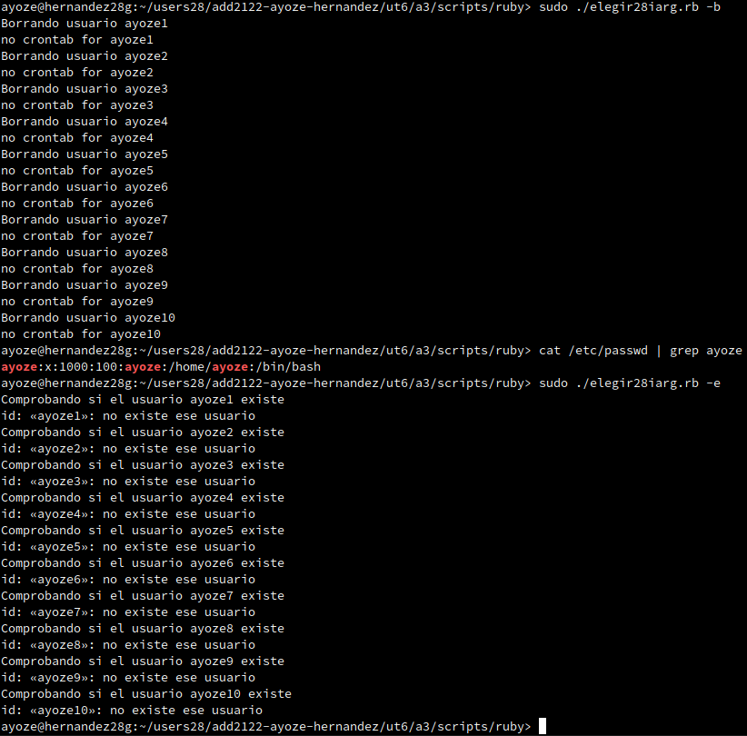

<center>

# Scripts iterativos con bash y ruby

</center>

***Nombre:*** Ayoze Hernández Díaz.
***Curso:*** 2º de Ciclo Superior de Administración de Sistemas Informáticos en Red.

### ÍNDICE

+ [Requisitos](#id1)
+ [Bash](#id2)
  + [Creación de usuarios](#id21)
  + [Borrado de usuarios](#id22)
  + [Fichero de elección](#id23)
+ [Ruby](#id3)
  + [Creación de usuarios](#id31)
  + [Borrado de usuarios](#id32)
  + [Fichero de elección](#id33)

#### ***Requisitos***. <a name="id1"></a>

Para realizar la práctica necesitamos lo siguiente:

* Paquete de desarrollo para bash
* Paquete de desarrollo para ruby

#### ***Bash***. <a name="id2"></a>

Con bash vamos a realizar 3 programas:

* [Creación de usuarios](./bash/crear-usuarios28iter.sh)
* [Borrado de usuarios](./bash/borrar-usuarios28iter.sh)
* [Fichero de elección](./bash/elegir28iter.sh)

##### ***Crear usuarios***. <a name="id21"></a>

Como vamos a usar bucles debemos de conocer la sintaxis primero:

```
#!/usr/bin/env bash

for i in `seq 10`; do
    echo "$i código que se ejecuta"
done

```

Ahora vemos el contenido del fichero.

```
#!/usr/bin/env bash

figlet ayoze28

NOMBRES=$(cat users.txt)

for i in $NOMBRES; do
    echo=$(id $i || echo $?)
    if [ "$echo" = "1" ]; then
        echo "Creando usuario $i"
        useradd $i
    else
        echo "El usuario $i ya existe"
    fi
done
```

Vemos la salida del fichero:


Comprobamos que existen los usuarios.


##### ***Borrar usuarios***. <a name="id22"></a>

Vemos el contenido del fichero.

```
#!/usr/bin/env bash

figlet ayoze28

NOMBRES=$(cat users.txt)

for i in $NOMBRES; do
    echo=$(id $i || echo $?)
    if ! [ "$echo" = "1" ]; then
        echo "Borrando usuario $i"
        userdel $i -r -f
    else
        echo "El usuario $i no existe"
    fi
done
```

```
ACLARACIÓN: En el condicional anterior se puede ver una señal de exclamación en:

... if ! [ "$echo" = "1" ]; then ...

Lo que esto significa es que si no se cumple la condición siguiente se ejecute el contenido del if.

```

Vemos la salida del fichero:


Comprobamos que no existen los usuarios


##### ***Fichero de elección***. <a name="id23"></a>

Vemos el contenido del fichero.

```
#!/usr/bin/env bash

NOMBRES=$(cat users.txt)


if [ "$1" = "-e" ]; then
    echo "Comprobando si los usuarios existen"
    for i in $NOMBRES; do
        id $i
    done
elif [ "$1" = "-c" ]; then
    bash ./crear-usuarios28iter.sh
elif [ "$1" = "-b" ]; then
    bash ./borrar-usuarios28iter.sh
fi
```

Veamos la salida del fichero:

Con la opción "-e" para comprobar la existencia de los usuarios.


Con la opción "-b" para borrar usuarios.


Con la opción "-c" para crear usuarios.


#### ***Ruby***. <a name="id3"></a>

Con ruby vamos a realizar 3 programas:

* [Creación de usuarios](./ruby/crear-usuarios28iter.rb)
* [Borrado de usuarios](./ruby/borrar-usuarios28iter.rb)
* [Fichero de elección](./ruby/elegir28iarg.sh)

##### ***Crear usuarios***. <a name="id31"></a>

Vemos el contenido del fichero.


```
#!/usr/bin/env ruby

system("figlet ayoze28")

NOMBRES = File.read('users.txt').split

for i in NOMBRES
    puts "Creando usuario #{i}"
    system("useradd -g users -d /home/#{i} -m -s /bin/bash #{i}")
end
```

Vemos la salida del fichero:


Comprobamos que los usuarios existen:


##### ***Borrar usuarios***. <a name="id32"></a>

Vemos el contenido del fichero.


```
#!/usr/bin/env ruby


NOMBRES=File.read('users.txt').split

for i in NOMBRES
    puts"Borrando usuario #{i}"
    system("userdel #{i} -r -f")
end
```

Vemos la salida del fichero:


Comprobamos que solo existe ayoze:


##### ***Fichero de elección***. <a name="id33"></a>

Vemos el contenido del fichero.

```
#!/usr/bin/env ruby

NOMBRES=File.read('users.txt').split


if ARGV[0]=="-c" then
    for i in NOMBRES
        system("useradd -g users -d /home/#{i} -m -s /bin/bash #{i}")
    end
elsif ARGV[0]=="-b" then
    for j in NOMBRES
        puts"Borrando usuario #{j}"
        system("userdel #{j} -r -f")
    end
elsif ARGV[0]=="-e" then
    for l in NOMBRES
        puts "Comprobando si el usuario #{l} existe"
        system("id #{l}")
    end
end
```

Vemos la salida del fichero:

Con la opción -e para comprobar la existencia de los usuarios:


Con la opción -b para borrar los usuarios:



Con la opción -c para crear los usuarios:


