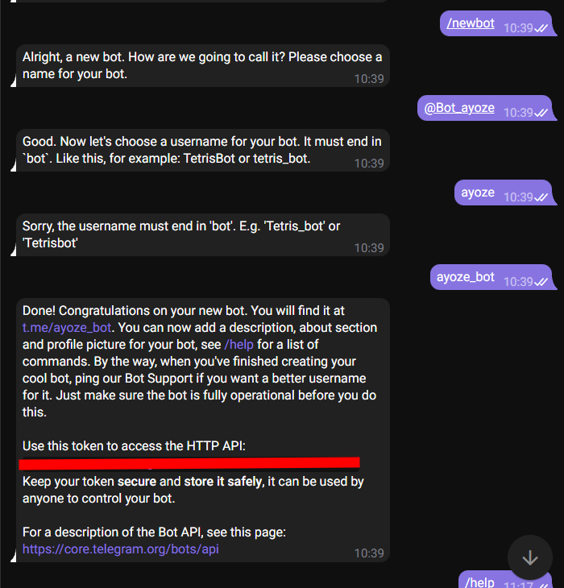
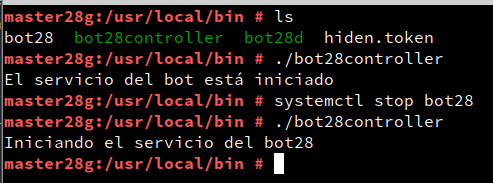
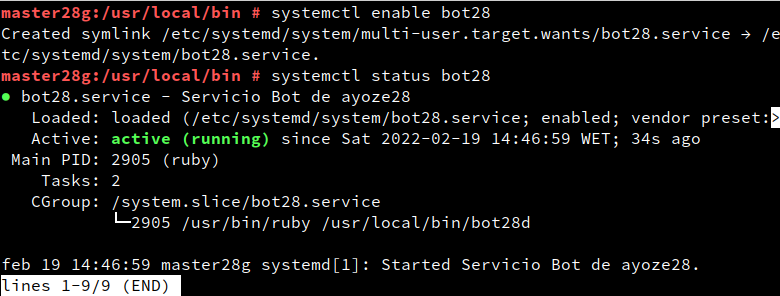

<center>

# Creación de un bot de Telegram con Ruby


</center>

***Nombre:*** Ayoze Hernández Díaz
***Curso:*** 2º de Ciclo Superior de Administración de Sistemas Informáticos en Red.

### ÍNDICE

+ [Introducción](#id1)
+ [Objetivos](#id2)
+ [Bot de Telegram](#id3)
+ [Controlador](#id4)
+ [Servicio](#id5)

#### ***Introducción***. <a name="id1"></a>

El lenguaje de programación ruby es mundialmente conocido por su simpleza y por la cantidad de maneras en las que se pueden realizar las mismas acciones escribiendo de manera diferente el código.

#### ***Objetivos***. <a name="id2"></a>

El objetivo es realizar un Bot de telegram usando el lenguaje de programación ruby y que ejecute los siguientes comandos:

* /help: Muestra un menú de ayuda
* /ip: Muestra la ip del bot
* /version: Muestra quién fue el creador del bot y que día fue operativo
* /chat: Devuelve un saludo, para ello se pueden introducir tu nombre y apellidos
* /command: Cuando se ejecuta acompañado de un comando del sistema devuelve el output del mismo.


#### ***Bot de Telegram***. <a name="id3"></a>

Primeramente debemos de crear el bot de telegram mediante el uso de otro bot llamado **"@Bot_Father"** en telegram, se siguieron los siguientes pasos.

1. Usamos el comando /start de Bot_Father para que nos muestre un menú de lo que podemos hacer con él.


2. Usamos el comando /newbot para indicar que queremos crear un bot nuevo, le asignamos un nombre y nos devuelve un texto con un enlace para compartir nuestro bot además del token que debemos usar para configurarlo nosotros con nuestros scripts.



3. Para realizar un bot de telegram funcional se ha utilizado el siguiente script desarrollado en clase y en casa:

> **NOTA:** Por motivos de seguridad no se adjunta el token del bot en ninguna de las carpetas ni en las captuas adjuntas.

```
#!/usr/bin/env ruby

require 'telegram/bot'

# token:
# 1. Write your TOKEN value into "token" variable or
# 2. Create a local file "hiden.token" with your TOKEN value inside

ip = `hostname -I`
version = "Autor: Ayoze Hernández Díaz\nFecha: 18/02/22"

token = `cat hiden.token`.strip

bot_username = '@ayoze_bot'
puts "[INFO] El bot está arrancando #{$0} ..."
Telegram::Bot::Client.run(token) do |bot|
  bot.listen do |message|
    options = message.text.split(" ")
    puts " => #{message.text}"
    if message.text == "/help"
      bot.api.send_message(chat_id: message.chat.id, text: "Los comandos del bot son los siguientes:\n · /help muestra la ayuda de los comandos del bot\n · /ip Muestra la ip del equipo en el que está alojado el bot\n · /command Ejecuta comandos del sistema\n · /chat Te devuelve un 'Saludos (Tu nombre)'\n · /version te muestra el autor del bot y la fecha de creación")
    elsif message.text == "/ip"
      bot.api.send_message(chat_id: message.chat.id, text: ip)
    elsif message.text == "/version"
      bot.api.send_message(chat_id: message.chat.id, text: version)
    elsif options[0] == "/command"
      contiene_comando = message.text.sub "/command", ""
      comando = `#{contiene_comando}`
      bot.api.send_message(chat_id: message.chat.id, text: comando)
    elsif options[0] == "/chat"
      decir = "Gracias por usar este bot #{options[1]}! Tus apellidos son #{options[2]} #{options[3]}."
      bot.api.send_message(chat_id: message.chat.id, text: decir)
    end
  end
end

```

Cuando ejecutamos el script podemos ejecutar todos los comandos del bot en su chat de telegram, vease el video del [funcionamiento del bot.](https://youtu.be/IE79k2ISa_c)

#### ***Controlador***. <a name="id4"></a>

Para mantener en orden el funcionamiento del bot de telegram debemos de tener un controlador que nos devuelva el estado del bot, es decir que compruebe si está funcionando o no y mande el resultado a un fichero log.

```
#!/usr/bin/env ruby

date = `date`

if system("systemctl status bot28 > /dev/null 2>&1") == true then
   system("echo '#{date} => Esta wea no funciona!' >> /etc/bot28/log")
   puts "El servicio del bot está iniciado"
else
   system("systemctl start bot28")
   system("echo '#{date} => Iniciando el servicio bot28d ...' >> /etc/bot28/log")
   puts "Iniciando el servicio del bot28"
end
```

Ejecutamos el controller para ver si funciona y vemos los logs

Ejecución:


Logs:



#### ***Servicio***. <a name="id5"></a>

Para habilitar nuestro bot como servicio debemos de añadir un fichero en la ruta **/etc/systemd/system** llamado bot28.service que contendrá lo siguiente:

```
[Unit]
Description=Servicio Bot de ayoze28             # Descricion del bot.
After=network.service                           # Se inicia después del network.service.

[Service]
Type=simple                                     # Indica que es un servicio de rápido lanzamiento.
ExecStart=/usr/bin/ruby /usr/local/bin/bot28d   # Indica como se debe ejecutar.

[Install]
WantedBy=multi-user.target                      # Indica que admite la conexión a internet.

```

Probamos a iniciar, parar, habilitar y comprobar el estado del servicio.

Estado inicial del bot28:


Iniciando el bot28:


Parando el bot28:


Habilitando el bot28:


